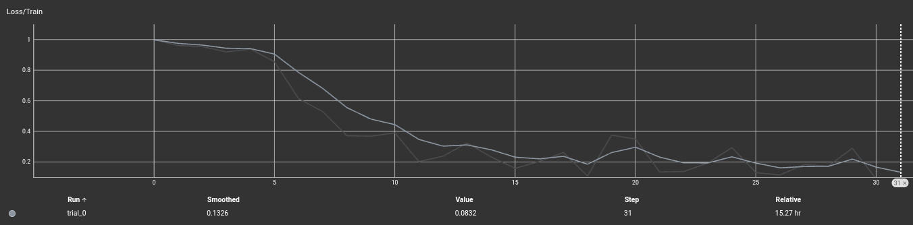
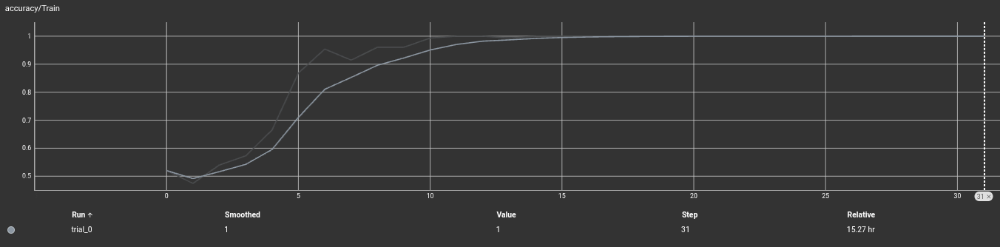
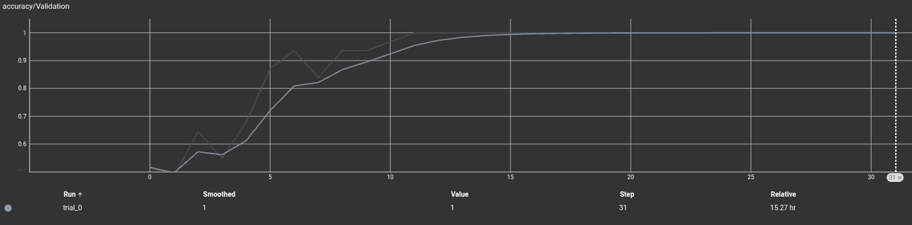
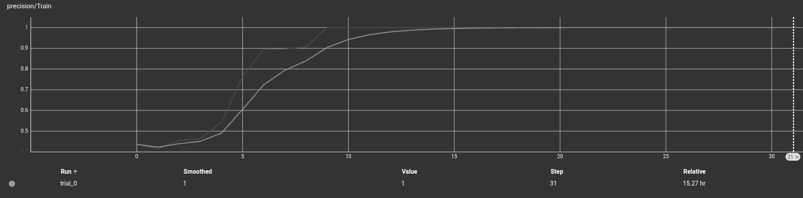
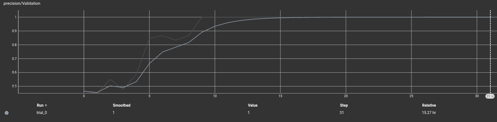
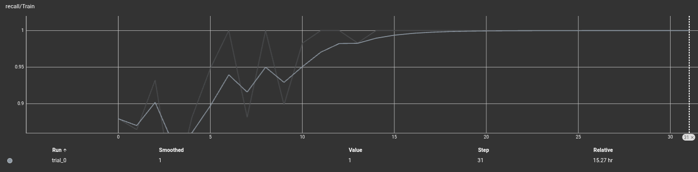
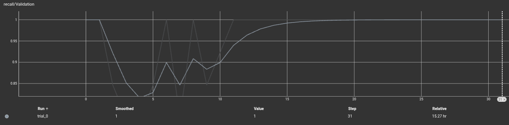
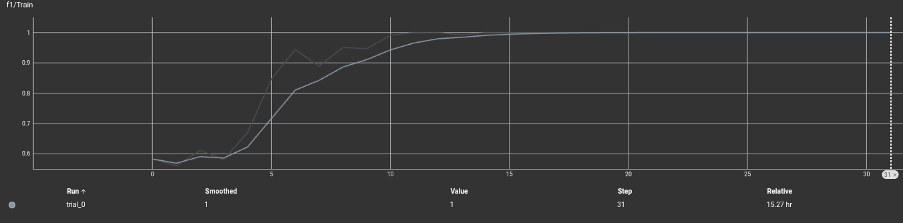
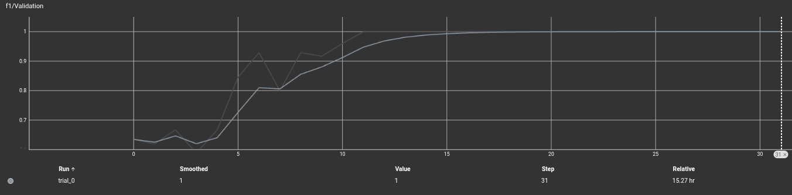

# PWADL_SoSe26 - Dokumentation:

## Kapitel 1 - Problembeschreibung:

### Ausgangslage:	

Laut statistischem Bundesamt gab es 2020 1448 Unfälle in Deutschland, die durch Müdigkeit am Steuer entstanden sind. Die Dunkelziffer wird deutlich höher geschätzt, da unter anderem 26% der befragten Fahrer im Rahmen einer Befragung des DVR zugaben schon einmal am Steuer eingeschlafen zu sein. Verschiedenster Studien zufolge sind bis zu 25% der Todesopfer im Straßenverkehr auf Müdigkeitsunfälle zurückzuführen. [https://www.dvr.de/ueber-uns/positionen-des-dvr/beschluesse/muedigkeit-im-strassenverkehr]
		
Seit Juli 2024 sind Müdigkeitswarner für neue Autos in der EU Pflicht. Um die Müdigkeitserkennung zu verbessern, wird weltweit nach Möglichkeiten der besseren Erkennung gesucht. Der Einsatz von neuronalen Netzen gilt als eine der vielversprechenden Varianten der Müdigkeitserkennung. Diese werden klassisch zur Videoanalyse ausgelegt und auf  verschiedensten Datensätzen trainiert. Einer der größten Datensätze in diesem Bereich ist der YawDD-Datensatz eingereicht von Shervin Shirmohammadi im Jahre 2020. Dieser wird bis heute (08/2026) aktuell gehalten. [https://ieee-dataport.org/open-access/yawdd-yawning-detection-dataset]

Dieses Projekt befasst sich mit der Müdigkeitserkennung durch ein ResNet, um visuelle Anzeichen auf Müdigkeit in Videodateien zu erkennen. Als Datensatz dient der YawDD-Datensatz, welcher mit eigenen Aufnahmen erweitert wurde.

---

### Modell-Architektur + Mathematische Beschreibung:
		
#### Feature-Extraktion:

Als Backbone wird ein vortrainiertes ResNet18-Modell verwendet. Die finale Klassifikationschicht wird entfernt, sodass ausschließlich die Merkmalsextraktion genutzt wird.

Input:

        X ∈ R^{B * T * C * H * W}

mit

- B = Batchgröße
- T = Anzahl Frames
- C = Farbkanäle
- H & W = Bildgröße

Jedes Frame wird unabhängig durch ResNet18 verarbeitet.

Output:

        F ∈ R^{B * T * D}

mit

- D = 512

als Feature-Dimension.

#### Temporal Attention Pooling:

Da nicht alle Frames einer Videosequenz gleich relevant sind, wird ein Attetion-Mechanismus zu Gewichtung der Frames verwendet.

Für jedes Frame t:

        s_t ​= W_2(tanh(W_1 *​f*_t​))
 
Anschließend werden die Attention-Gewichte berechnet:

        α_t​ = e^(s_t) / sum_j{e^(s_j)}
 
Die Videorepräsentation ergibt sich durch:

        z = sum_(t=1){​α_t ​f_t}

#### Klassifikationskopf:

Die aggregierten Features werden durch mehrere Fully-Connected-​Layers verarbeitet:

        512 -> 256 -> 128 -> 1

mit:

- Batch Normalization
- ReLU
- Dropout

Der Finale Logit lautet:

        y = f(z)

Die Wahrscheinlichkeit eines Gähnens wird über die Sigmoid-Funktion berechnet:

        p(y=1) = σ(y)

#### Lossfunction:

Verwendet wird:

        L = BCEWithLogitsLoss()

mit einer Klassengewichtung:

        pos_weight = 2.0

um die positive Klasse stärker zu gewichten.

---

### Optimizer:

Für die Optimierung des neuronalen Netzes wird der **AdamW-Optimizer** verwendet. AdamW kombiniert die Vorteile des adaptiven Adam-Optimierers mit einer verbesserten Regularisierung durch sogenanntes Weight Decay. Während klassische Optimierungsverfahren für alle Parameter dieselbe Lernrate verwenden, passt AdamW die Lernraten für einzelne Parameter anhand der während des Trainings beobachteten Gradienten dynamisch an. Dadurch kann das Modell in der Regel schneller und stabiler konvergieren.

Im Rahmen dieses Projekts wird eine Lernrate von 1.03*10^(-4) sowie ein Weight Decay von 0.01 verwendet. Das Weight Decay wirkt einer Überanpassung (Overfitting) entgegen, indem große Parameterwerte während des Trainings bestraft werden. Aufgrund seiner Robustheit und guten Leistung hat sich AdamW als Standardverfahren für viele moderne Deep-Learning-Anwendungen etabliert.

---

### Gradient Clipping:

Zur Verbesserung der Trainingsstabilität wird Gradient Clipping eingesetzt. Während des Backpropagation- Schrittes können insbesondere bei tiefen neuronalen Netzen sehr große Gradienten entstehen. Dieses sogenannte Exploding-Gradient-Problem kann zu instabilen Parameterupdates und einem fehlerhaften Trainingsverlauf führen.

Um dies zu verhindern, werden die Gradienten aller Modellparameter nach jeder Rückwärtspropagation auf einen maximalen Betrag von 1.0 begrenzt. Überschreitet die Norm der Gradienten diesen Wert, werden sie entsprechend skaliert. In der Implementierung erfolgt dies mithilfe der Funktion:

        torch.nn.utils.clip_grad_norm_(
                model.parameters(),
                max_norm=1.0
        )

Durch diese Maßnahme wird ein stabilerer Trainingsprozess erreicht, da einzelne Ausreißer bei den Gradienten nun keinen übermäßig großen Einfluss auf die Aktualisierung der Modellparameter mehr haben.

---

## Kapitel 2 - Datensatz:

### Beschreibung des Datensatzes:

Für die Durchführung des Projekts wurde hauptsächlich der **YawDD Mirror Videos Datensatz** verwendet. Die Quelle des Datensatzes ist in Kapitel 1 angegeben. Zusätzlich wurden eigene Videoaufnahmen erstellt und in den Datensatz integriert, um die Anzahl der Trainingsbeispiele zu erhöhen und zusätzliche Variationen hinsichtlich Personen, Beleuchtung und Aufnahmebedingungen abzudecken.

Der Datensatz enthält Videos von Personen sowohl **mit Gähnen** als auch **ohne Gähnen**. Darüber hinaus wurden verschiedene Erscheinungsformen berücksichtigt, sodass sowohl Aufnahmen von Personen **ohne Brille**, **mit Brille** sowie **mit Sonnenbrille** enthalten sind. Dies erhöht die Robustheit des Modells gegenüber unterschiedlichen realen Einsatzbedingungen.

Alle Videos besitzen eine Länge von ungefähr **30 Sekunden** und liegen in einer Auflösung von **360p** vor. Die Videos wurden mit einer festen Kameraposition aufgenommen und zeigen das Gesicht der Person während verschiedener Aktivitäten.

Die Benennung der Videodateien folgt einem einheitlichen Schema:

        ID-Spezifikation-Label

---

### Daten-Split:

Eine zentrale Herausforderung bei biometrischen Datensätzen besteht darin, sogenannte Data Leaks zu verhindern. Werden Videos derselben Person gleichzeitig für Training und Test verwendet, kann das Model personenbezogene Merkmale lernen und dadurch unrealistisch gute Ergebnisse erzielen.

Um dieses Problem zu vermeiden, wurde eine gruppenbasierte Aufteilung des Datensatzes implementiert Die Gruppen werden durch die im Dateinamen enthaltenen Personen-IDs definiert. Für die Aufteilung wird die Klasse GroupShuffleSplit aus Scikit-Learn eingesetzt.

Die Daten werden in folgende Teilmengen aufgeteilt:

- Trainingsdaten: 70 %
- Validierungsdaten: 15 %
- Testdaten: 15 %

Als Group dient die in der Videobeschriftung enthaltene ID. Dadurch wird sichergestellt, dass eine Person ausschließlich in einem einzigen Datensatzsplit vorkommt. Zu beachten ist, dass die Nummerierung durch die ID bei Damen und Herren seperat beginnt, sodass die ID´s nicht einzigartig im Datensatz sind. Hier ist dies jedoch keine Einschränkung, sondern eine Möglichkeit die Gleichverteilung bezüglich des Geschlechtes
beim Training zu garantieren.

---

### Vorverarbeitung:

Da neuronale Netze keine Videodateien direkt verarbeiten können, müssen diese zunächst in Einzelbilder zerlegt werden.

Für jedes Video werden mithilfe des VideoDecoder gleichmäßig über die gesamte Videolänge verteilte Frames extrahiert.

Anschließend erfolgt eine Bildvorverarbeitung entsprechend der folgenden Vorgehensweise:

1. Skalierung auf 256 × 341 Pixel
2. Center Crop auf 224 × 224 Pixel
3. Umwandlung in Tensoren
4. Normalisierung anhand der ImageNet-Mittelwerte und Standardabweichungen

Die finale Eingabestruktur eines Videos besitzt somit die Dimension

        T × 3 × 224 × 224

wobei T die Anzahl der verwendeten Frames bezeichnet (Hier T = 64).

Bei den selbst aufgenommenen Videos muss die Auflösung vor dem Skalieren noch manuell von 1080p auf 360p herunterskaliert werden. Dies dient der Verkürzung der Zeit des Preprocessings.

---

### Vorbereitung der Daten:

1. Data-Ordner in Projekt-Ordner erstellen
z.B.:
        PWADL_soSe2026/
                data/
                        Video1
                        Video2
                        Video3
                        ...
                src/
                ...
2. YawDD-Dataset herunterladen [https://ieee-dataport.org/open-access/yawdd-yawning-detection-dataset] Hiefür muss ein Account bei IEEE-Dataport angelegt werden.
3. Videos aus Mirror-Ordner in Data-Ordner verschieben
4. Eigene Videos in Data-Ordner (Auflösung beachten)
5. ggf. DashCam Videos aus YawDD hinzufügen, hierbei muss jedoch der Titel der Videos nach der vorher festgelegten Benennung angepasst werden

---

### Visualisierung:
        
Zur Visualisierung der Daten wird TensorBoard verwendet. Diese zeichnet während des Trainings verschiedene Metriken auf und stellt diese Extern graphisch dar. Folgende Metriken werden gepeichert:

- Loss
- Accuracy
- Precision
- Recall
- F1-Score
- Lernrate

Nach einem erfolgreichen Training können die erzeugten Logs visualisiert werden. Hierzu müssen die beim Training erzeugten Daten in den Ordnern checkpoints/ und runs/ vorhanden sein. Um die Visualisierung durchzuführen muss folgender Befehl im Terminal ausgeführt werden:

        tensorboard --logdir runs

TensorBoard kann nun über einen erschaffenen und im Terminal angegebenen lokalen Webserver abgerufen werden. Die URL sollte ungefähr so aussehen:

        http://localhost:6006/

---

## Kapitel 3 - Code und Anweisungen zum Ausführen des Repositorys:

### Projektstruktur:

Das Repository ist modular aufgebaut und trennt Datenverarbeitung, Modellarchitektur, Training und Evaluation voneinander.

        PWADL_SoSe26/
                data/
                checkpoints/
                runs/
                src/
                        data.py
                        evaluation.py
                        training.py
                        utils.py
                main.py
                config.py [!!!TODO!!!]

Diese Struktur erleichtert sowohl die Wartung als auch die Erweiterung des Projekts.

---

### Verwendete Bibliotheken:

Für die Implementierung wurden ausschließlich etablierte Python-Bibliotheken verwendet.

- PyTorch [Installationsbefehl sollte von der PyTorch-Website kopiert werden. Den Befehl nutzen, welcher an das benutzte System angepasst ist.]

        [https://pytorch.org/get-started/locally/]

- Torchvision

        pip install torch torchvision

- TorchCodec [Die mit TorchCodec und Python kompatible FFMpeg Version muss vorab installiert und dem PATH hinzugefügt werden.]

        pip install torch torchcodec

        FFMpeg-Anleitung (Windows): [https://www.wikihow.com/Install-FFmpeg-on-Windows]

- Pandas

        pip install pandas

- NumPy

        pip install numpy

- Scikit-Learn

        pip install scikit-learn

- Optuna

        pip install optuna

- TensorBoard

        pip install tensorboard

- tqdm

        pip install tqdm

- psutil

        pip install psutil

PyTorch bildet dabei die Grundlage für die Implementierung und das Training des neuronalen Netzes. Torchvision wird für das Laden des vortrainierten ResNet18 genutzt, während TorchCodec die Dekodierung der Videodateien übernimmt.

---

### Setup-Anweisungen:

1. Installierung von VisualStudioCode
2. Repository aus Github herunterladen
3. Ordner des Repository in VisualStudioCode öffnen
4. Python und Jupyter_Notebooks in VisualStudioCode installieren
5. Data-Ordner erschaffen und in Kapitel 2 empfohlene Schritte durchführen
6. FFmppeg installieren und den PATH hinzufügen (Bei Linux nicht benötigt)
7. Virtuelles Environment erschaffen
8. Alle benötigten Bibliotheken installieren
9. Debugger einrichten

---

### Trainingsverfahren:

Das Training erfolgt als binäre Klassifikation.

Als Verlustfunktion wird die Binary Cross Entropy mit Logits verwendet (BCEWithLogitsLoss). Zusätzlich wird die positive Klasse durch einen Gewichtungsfaktor von 2.0 stärker berücksichtigt. Dadurch sollen Fehler bei der Erkennung von Gähnen stärker bestraft werden als Fehler bei der negativen Klasse.

Zur Optimierung wird der AdamW-Optimizer eingesetzt, welcher gegenüber klassischem Adam eine verbesserte Regularisierung durch Weight Decay ermöglicht.

Zusätzlich wird Gradient Clipping verwendet, um instabile Gradienten während des Trainings zu verhindern.

---

### Hyperparameter:

Für die Experimente wurden folgende Parameter verwendet:

        Batch Size = 4

        Learning Rate = 1.03 · 10^-4

        Dropout = 0.2

        Frames/Video = 64

        Epochen, um Overfitting zu finden = 32

        Optimale Epochen = 15

        Optimizer = AdamW

        Weight Decay = 0.01

Diese ergaben sich als gute Hyperparamter unter Beachtung des zeitlichen Rahmens und der vorhandenen Hardware. Details folgen in den weiteren Kapiteln.

---

### Hyperparameteroptimierung:

Das Projekt verwendet Optuna zur automatisierten Hyperparameteroptimierung.

Die Optimierung basiert auf dem F1-Score des Validierungsdatensatzes. Dadurch wird nicht nur die reine Klassifikationsgenauigkeit betrachtet, sondern gleichzeitig das Gleichgewicht zwischen Precision und Recall berücksichtigt.

Für jede Hyperparameterkombination wird ein eigener TensorBoard-Log erzeugt und das jeweils beste Modell automatisch gespeichert.

Im Laufe des Projektes wurden insgesamt 27 Trials zur Findung der oben beschriebenen Hyperparamter durchgeführt. Die Absolvierung von deutlich mehr Trials wird als sinnvoll angesehen, insofern die Hardware genug Leistung hat, um in einer angebrachten Zeit Trials durchzuführen.

---

### Evaluation:

Die Bewertung des Modells erfolgt anhand der vier wichtigsten Metriken für binäre Klassifikation:

- Accuracy
- Precision
- Recall
- F1-Score

Als finale Vorhersage wird die Sigmoid-Ausgabe des Modells verwendet.

Liegt die vorhergesagte Wahrscheinlichkeit über 50 %, wird das Video als „Gähnen“ klassifiziert.

---

## Kapitel 4 - Ergebnisse und Diskussion:

### Laufzeit und Ressourcen:

Hardware:

        OS: Linux
        CPU: Intel Core i7-10510U (8GB) 4.90GHz
        GPU: Intel UHD Graphics 1.15Ghz (Integrated)
        RAM: 16GB DDR4

Laufzeit finaler Test:

        Datenmenge: Alle YawDD-Mirrorvideos, Eigene Videos
        Einzigartige Personen: 42 female, 52 male
        Batch Size: 4
        Epochen: 32
        Trials: 1
        Frames: 64
        Laufzeit: 15h 46min 12sec

---

### Verwendete Metriken:

Zur Bewertung des Modells wurden die Metriken Accuracy, Precision, Recall und F1-Score verwendet. Während Accuracy den Anteil korrekt klassifizierter Beispiele beschreibt, ermöglichen Precision und Recall eine differenziertere Betrachtung der Klassifikationsleistung. Als wichtigste Kennzahl wurde der F1-Score verwendet, da dieser Precision und Recall gleichermaßen berücksichtigt und insbesondere bei unausgewogenen Datensätzen aussagekräftiger ist als die reine Accuracy.
 
Die Auswahl des besten Modells erfolgte anhand des F1-Scores auf dem Validierungsdatensatz. Während des Trainings wurden sämtliche Metriken mit TensorBoard protokolliert und visualisiert.

---

### Darstellung der Metriken:

Das Training wurde über 32 Epochen durchgeführt. Bereits nach wenigen Epochen zeigte das Modell deutliche Lernfortschritte. Der Train-Loss sank kontinuierlich von etwa 1,0 auf unter 0,1 und näherte sich gegen Ende des Trainings einem stabilen Minimum an.

 

Gleichzeitig stiegen die Kennzahlen Accuracy, Precision, Recall und F1-Score sowohl auf den Trainings- als auch auf den Validierungsdaten kontinuierlich an. Gegen Ende des Trainings wurden auf beiden Datensätzen Werte von nahezu 100 % erreicht, was auf Overfitting hinweist.

 

Der beste während des Trainings erreichte F1-Score auf dem Validierungsdatensatz lag bei ungefähr 0,94. Ab ungefähr 15 Epochen fängt es an, dass Overfitting ersichtlich wird. Daher wird ein Training mit 15 Epochen empfohlen.

 

Die TensorBoard-Kurven zeigen dabei einen insgesamt sehr stabilen Trainingsverlauf ohne größere Schwankungen oder Instabilitäten. Besonders deutlich wird dies an dem stetigen Anstieg der Precision- und Recall-Werte sowie dem gleichmäßigen Rückgang des Trainingsverlustes.

Zur abschließenden Bewertung wurde das trainierte Modell auf einem zuvor nicht verwendeten Testdatensatz untersucht.

Dabei wurde eine Test Accuracy von

**86,67 %**

erzielt.

Dieses Ergebnis zeigt, dass das Modell einen Großteil der Testvideos korrekt klassifizieren konnte und die während des Trainings erlernten Muster grundsätzlich auf bisher unbekannte Daten übertragen kann.

Gleichzeitig fällt auf, dass die Leistung auf dem Testdatensatz sichtbar unter den Ergebnissen von Trainings- und Validierungsdaten liegt. Während in den Trainings- und Validierungsdaten nahezu perfekte Werte erreicht wurden, sinkt die Accuracy auf dem Testdatensatz auf 86,67 %.

---

### Vergleich mit anderen wissenschaftlichen Arbeiten:

Die automatische Erkennung von Müdigkeit und insbesondere von Gähnvorgängen ist seit mehreren Jahren Gegenstand aktueller Forschung. Während frühe Ansätze hauptsächlich auf handentwickelten Merkmalen wie dem Mouth Aspect Ratio (MAR), Gesichtslandmarken oder klassischen Bildverarbeitungsverfahren basierten, kommen heute überwiegend Deep-Learning-Modelle zum Einsatz. Dabei werden Convolutional Neural Networks (CNNs), Objekterkennungsverfahren wie YOLO oder zunehmend auch Transformer-basierte Architekturen verwendet.

Das in dieser Arbeit entwickelte Modell basiert auf einem vortrainierten ResNet18 als Feature-Extraktor sowie einer zusätzlichen temporalen Attention-Schicht zur Verarbeitung mehrerer Videoframes. Im Gegensatz zu vielen klassischen Ansätzen werden nicht einzelne Bilder, sondern vollständige Videosequenzen betrachtet. Die zeitliche Information wird dabei durch die Attention-Gewichtung der einzelnen Frames berücksichtigt.

Auf dem verwendeten Testdatensatz wurde eine Accuracy von 86,67 % erreicht. Dieser Wert liegt unter den Ergebnissen aktueller Spitzenmodelle aus der Literatur, die häufig Genauigkeiten zwischen etwa 96 % und 99 % berichten. Beispielsweise erreichen Majeed et al. (2023) für ihre CNN-basierte Müdigkeitserkennung eine durchschnittliche Accuracy von 96,69 %. Eine aktuelle Arbeit von Makhmudov et al. (2024) berichtet für ein CNN-basiertes Müdigkeitserkennungssystem eine Testgenauigkeit von 96,54 %. Für speziell auf dem YawDD-Datensatz entwickelte Verfahren werden teilweise sogar Genauigkeiten von über 99 % angegeben. So berichten Lindskog et al. (2024) eine Accuracy von 99,2 % auf Basis eines föderierten Lernansatzes unter Verwendung von YawDD. Ebenso zeigt das kürzlich veröffentlichte YawDD+-Projekt auf Basis genauer Frame-Annotationen Klassifikationsgenauigkeiten von bis zu 99,34 %.

Die Unterschiede zu diesen Ergebnissen lassen sich jedoch nicht ausschließlich auf die Modellarchitektur zurückführen. Die genannten Arbeiten nutzen oftmals deutlich umfangreichere Vorverarbeitungsschritte, Datenaugmentation, präzisere Frame-Level-Annotationen oder speziell auf Müdigkeitserkennung optimierte Netzwerke. Darüber hinaus erschweren unterschiedliche Datensplits und Evaluationsverfahren einen direkten Vergleich der Ergebnisse.

Trotz der geringeren Testgenauigkeit besitzt der im Rahmen dieses Projekts entwickelte Ansatz mehrere Vorteile. Das verwendete ResNet18 ist vergleichsweise kompakt und benötigt deutlich weniger Rechenleistung als moderne Video-Transformer oder große CNN-Modelle. Gleichzeitig kann durch die Nutzung eines vortrainierten Backbones auf umfangreiche Bildmerkmale zurückgegriffen werden, ohne dass ein sehr großer Trainingsdatensatz erforderlich ist. Die zusätzliche Attention-Schicht ermöglicht es dem Modell, relevante Frames innerhalb einer Videosequenz gezielt stärker zu gewichten.

Insgesamt erreicht das Modell zwar noch nicht die Leistungsfähigkeit aktueller Spitzenverfahren, bewegt sich jedoch im Bereich leistungsfähiger CNN-basierter Ansätze für die Gähnerkennung. Die Ergebnisse zeigen, dass bereits eine vergleichsweise einfache Architektur aus ResNet18 und temporaler Attention in der Lage ist, Müdigkeitsmerkmale zuverlässig aus Videodaten zu extrahieren. Weitere Verbesserungen könnten durch Datenaugmentation, Learning-Rate-Scheduling, Early Stopping sowie den Einsatz moderner Videoarchitekturen wie 3D-CNNs oder Vision-Transformern erzielt werden.

---

### Besonderheiten und Schwächen:

#### Stärken des Ansatzes:

Der gewählte Ansatz besitzt mehrere Vorteile:
 
- Nutzung eines vortrainierten ResNet18 und damit Verwendung bereits gelernter Bildmerkmale.

- Effiziente Verarbeitung von Videosequenzen durch Frame-basierte Merkmalsextraktion.

- Attention-Mechanismus zur Gewichtung relevanter Frames.

- Vergleichsweise geringe Modellkomplexität gegenüber 3D-CNNs oder Video-Transformern.

- Gruppenbasierter Datensplit verhindert Datenlecks zwischen den Datensätzen.
 
Darüber hinaus konnte das Modell bereits mit vergleichsweise wenigen Trainingsdaten eine akzeptable Testgenauigkeit erzielen.

#### Schwächen und Verbesserungspotential:

Trotz der positiven Ergebnisse existieren verschiedene Ansätze zur weiteren Verbesserung.

Die aktuell verwendete Architektur verarbeitet die zeitliche Information nur indirekt über die Attention-Schicht. Moderne Videoarchitekturen wie 3D-CNNs, ConvLSTMs oder Vision Transformer für Videos könnten zeitliche Bewegungsabläufe möglicherweise besser modellieren. Zusätzlich wird nur die Videokomponente verwendet. Ein multimodales Netz mit Audioeinfluss kann möglicherweise zu besseren Ergebnissen führen. Auch das Labeln der Daten findet über den Titel der Videodateien statt. Eine präzisere Anbringung des Labels innerhalb des Videos könnte zu besseren Ergebnissen führen.

Zusätzlich wurden keine Verfahren wie Early Stopping oder Learning-Rate-Scheduling eingesetzt. Zwar wurden diese hier als nicht unbedingt nötig angesehen, dennoch könnten beide Methoden helfen, die Generalisierungsfähigkeit des Netzwerks weiter zu verbessern und Overfitting zu reduzieren.

Eine weitere Möglichkeit wäre die Vergrößerung des Datensatzes durch zusätzliche Aufnahmen oder gezielte Data-Augmentation-Verfahren. Die Erweiterung des Datensatzes wird stark empfohlen und würde das neuronale Netz besser an seine Aufgabe anpassbar machen.

---

### Quellen Kapitel 4:

- https://www.mdpi.com/1424-8220/23/21/8741

- https://www.mdpi.com/1424-8220/24/23/7810

- https://arxiv.org/pdf/2405.03311

- https://arxiv.org/abs/2512.11446

---