# Multimodal Yawning Detection from Video and Audio

Praktisches Wissenschaftliches Arbeiten mit Deep Learning (PWADL) - SoSe26

**Author:** [Stefan Oelbracht]  
**Repository:** [PWADL_SoSe26 - StOe_Multimodal branch](https://github.com/StOe11169/PWADL_SoSe26/tree/StOe_Multimodal)   
**Project status:** The pipelines are implemented and tested, but  models have not yet been trained. All numerical result fields below are therefore placeholders and will be added at a later date.

## Table of contents

- [1. Problem statement](#1-problem-statement)
- [2. System overview](#2-system-overview)
- [3. Datasets](#3-datasets)
- [4. Preprocessing and augmentation](#4-preprocessing-and-augmentation)
- [5. Model architecture](#5-model-architecture)
- [6. Experimental design](#6-experimental-design)
- [7. Installation and execution](#7-installation-and-execution)
- [8. Evaluation metrics](#8-evaluation-metrics)
- [9. Preliminary results](#9-preliminary-results-two-of-five-outer-folds-as-of-28-august-2026)
- [10. Discussion](#10-discussion)
- [11. Limitations and threats to validity](#11-limitations-and-threats-to-validity)
- [12. Repository structure](#12-repository-structure)
- [13. References](#13-references)

## 1. Problem statement

This repository examines the effects of using multiple modes to detect yawning in a videosuequence and wether the added mode (audio) improves the ability to detect yawning.
Yawning being a visible and importantly only sometimes audible event that can be used to detect fatigue in drivers. Yawning itself is not a clear predictor of fatigue and drowsiness, but can aid in its detection. A practical fatigue detection system should additionaly use  eye closure, blink behaviour, head motion, or physiological measurements.
The narrower task of this project is **binary video-level yawning classification**. More specifically:

> Given a video containing a person, predict whether the clip contains yawning by combining visual facial motion and the accompanying sound.

The central question examined here is:

> **Does late fusion of independently trained visual and audio classifiers improve subject-independent yawning detection over either modality alone?**

Such this question can be divided further:

1. How accurately can yawning be detected from sampled RGB frames?
2. How accurately can it be detected from the audio track alone?
3. Does weighted late fusion improve performance on the same held-out participants?
4. Is an apparent fusion gain supported by the results, or does the fused model mainly reproduce one modality?

The positive class (1) is **yawning** and the negative class (0) combines **normal** and **talking** clips. A filename containing “Talking&Yawning” is therefore positive. This makes talking an important hard negative because both talking and yawning can involve an open mouth, a distinction already emphasized in the original YawDD work this project is based on ([Abtahi et al., 2014](https://doi.org/10.1145/2557642.2563678)).

## 2. System overview

The implementation is purposefully modular. Each can be run and trained in a standalone way. Each encoder produces one raw binary logit per video. The logits are aligned by filepath and combined only after the unimodal predictions have been produced.

~~~mermaid
flowchart TD
    V["Input video"]
    V --> VP["Visual preprocessing"]
    V --> AP["Audio preprocessing"]
    VP --> VM["ResNet-18 + attention pooling"]
    AP --> AM["YAMNet + mean pooling"]
    
    VM --> VL["Visual logit"]
    AM --> AL["Audio logit"]
    VL --> F["Weighted late fusion"]
    AL --> F
    F --> Y["Yawning probability and label"]
~~~

Three experiment modes are available:

| Mode | Input | Model output |
| --- | --- | --- |
| Visual | Uniformly sampled RGB frames | One visual logit per video |
| Audio | Four one-second clips sampled across a 16 kHz mono waveform | One audio logit per video |
| Multimodal | The same video processed by both pipelines | Weighted sum of visual and audio logits |

Late fusion was selected because it preserves two independently testable pipelines, makes unimodal ablations straightforward, and does not require the heterogeneous visual and audio feature sequences to have the same temporal resolution. This is a deliberately simple fusion baseline within the wider taxonomy of multimodal representation, alignment, and fusion methods described by [Baltrušaitis et al. (2019)](https://doi.org/10.1109/TPAMI.2018.2798607). This also makes it possible to determine which modality is the prominent indicator of the two. An information early-fusion would obstruct.

## 3. Datasets

### 3.1 YawDD visual dataset

YawDD was introduced specifically for yawning detection by [Abtahi et al. (2014)](https://doi.org/10.1145/2557642.2563678). The complete publication describes two in-vehicle views:

| Subset | Camera position | Published size | Structure |
| --- | --- | ---: | --- |
| Mirror / Case I | Below the front mirror | 320 videos | Three or four separate clips per participant, including normal, talking/singing, and yawning |
| Dash / Case II | On the dashboard | 29 videos | One longer clip per participant containing multiple mouth conditions |

The recordings were made in a parked car under varying illumination, with participants of different genders and facial characteristics, including glasses and sunglasses. The [official dataset page](https://www.site.uottawa.ca/~shervin/yawning/) links to the current open-access distribution. 

Additonally own videos where produced using the participants of this course. They where recorded in the same way as described by Abtahi et al..

### 3.2 Audio-capable project data

As the published YawDD files are distributed without audio. Therefore own videos where produced using the participants of this course. They where recorded in the same way as described by Abtahi et al.. just with audio. While both Dashboard and Mirrow views are available in the YawDD Dataset and the the self produced one. During training the mirror view from the YawDD Dataset and the dashboard view from the selfmade dataset where used. Unfortunatly I can not recall any specific reason for this decision. Each participant was recorded in each of the following conditions: 
| Eyewear condition    | Yawning recordings | Non-yawning recordings | Applicability                         |
| -------------------- | -----------------: | ---------------------: | ------------------------------------- |
| Without glasses      |                  2 |                      2 | All participants                      |
| With regular glasses |                  2 |                      2 | Participants who usually wore glasses |
| With sunglasses      |                  2 |                      2 | All participants                      |

The recordings were made consecutivly in a parked car during a partially cloudy day.Specifically Thursday,11 June 2026 in Gelsenkirchen, Germany.
The distribution of of participants of the self made, un-augmented dataset used here, as well as the technical details of the un-augmented dataset are:

|  |  |
| --- | --- |
| Number of participants | 5 |
| Number of videos | 48 |
| Positive / negative videos | **24 / 24** |
| Recording device and microphone | **TBD** |
| Video resolution and frame rate | **3840x2160px ; 29,97frames/s** |
| Original sample rate | **48.000kHz** |
| Avg. Clip Duration | **~30s** |


After recording, the custom videos were initially converted with VLC Media Player to approximate the resolution, frame rate, and bitrate of the YawDD videos. Because TorchCodec could not reliably seek within or decode the resulting MP4 files, the final copies were subsequently normalized using FFmpeg. This normalization regenerated presentation timestamps, shifted negative timestamps to zero, re-encoded the video as H.264 with YUV 4:2:0 pixel format, retained the audio as AAC, and rebuilt the MP4 container index. This normalization step was separate from data augmentation and did not change the labels.
To increase the limited dataset all videos where augmented once (doubling the dataset size) using the augment_dataset.py script found in this repository and treated as new participants.
This knowingly introduces data leakage, as the random transformations can not be so extreme that the participants cant be recognized as the same person, while still producing a useful video. This was deemed a worthy compromise in order to gain sufficient data for the nested-cross validation.
Before augmentation the dataset consisted of the 320 YawDD Videos and the 48 selfmade videos for a total of 368 videos.
All 368 videos are used for training the visual pipeline, but as the YawDD videos do not contain audio only 96 videos can be used to train the audio and multimodal pipelines.

### 3.3 Labels and filename convention

The data loader recursively scans the local directory named **data** for MP4, AVI, and MOV files. It expects every filename stem to contain exactly three hyphen-separated fields:

~~~text
<participant-id>-<participant-information>-<activity>.<extension>
~~~

Examples:

~~~text
001-FemaleNoGlasses-Normal.avi
001-FemaleNoGlasses-Talking.avi
001-FemaleNoGlasses-Yawning.avi
023-MaleGlasses-Talking&Yawning.avi
~~~

The label is derived from the activity field:

$$y_i =
\begin{cases} 
1, & \text{if “yawning” occurs in the activity string},\\
0, & \text{otherwise}.
\end{cases}$$


The label applies to the complete video even though the actual yawn occupies only a short interval. This is a known source of label noise and should be kept in mind when interpreting attention weights or failure cases. A different approach that would reduce the label noise significantly is described in ([Mujtaba et al., 2025](https://doi.org/10.48550/arXiv.2512.11446)) with its accompanying repository [here](https://opensource.silicon-austria.com/mujtabaa/yawdd) where each video of the original YawDD Dataset is annotated frame by frame using a csv file. This approach was not chosen in this project due to the amount of manual labbeling needed for the self produced videos.

### 3.4 Data layout

The repository does not include the training data. The original YAWD-Dataset can be found here: https://ieee-dataport.org/open-access/yawdd-yawning-detection-dataset
The self produced videos are not available to the public.
 A compatible layout of the data folder would be:

~~~text
data/
├── Mirror/
│   ├── 001-FemaleNoGlasses-Normal.avi
│   ├── 001-FemaleNoGlasses-Talking.avi
│   └── 001-FemaleNoGlasses-Yawning.avi
└── CustomAudioVisual/
    ├── 101-Participant-Normal.mp4
    └── 101-Participant-Yawning.mp4
~~~

Important: the command-line option named **--data** is currently written into the experiment configuration but does not change the scanned root; **main.py always calls get_all_data_paths("data")**. Stage only the intended experiment files under data, or change the loader before running from a different root.

### 3.5 Subject-independent splitting

Multiple clips from one participant are correlated. Random video-level splitting could place the same face in training and testing, allowing identity and background cues to inflate the measured performance. The implementation therefore uses the parsed participant ID as a group and [StratifiedGroupKFold](https://scikit-learn.org/stable/modules/generated/sklearn.model_selection.StratifiedGroupKFold.html) to keep groups disjoint while approximately preserving the class distribution.

The current nested cross-validation structure is:

- **Outer evaluation:** 5 subject-grouped folds.
- **Inner model selection:** 3 subject-grouped folds within each outer training partition.
- **Final epoch selection:** one grouped training/validation split taken from a separate 5-fold `StratifiedGroupKFold` applied only to the outer training partition.
- **Outer test data:** used once to evaluate the selected final model for that outer fold.

Although the final splitter is configured with five folds, the implementation calls `next(...)` and therefore uses only its first split; it does not train five additional final models.

Nested cross-validation is important here because using the same cross-validation results both to select hyper parameters and to report performance creates optimistic bias. This risk and the role of nested evaluation are demonstrated by [Varma and Simon (2006)](https://doi.org/10.1186/1471-2105-7-91) and [Cawley and Talbot (2010)](https://www.jmlr.org/papers/v11/cawley10a.html).

One repository specific thing to note is that grouping only uses the subjects ID. In the Mirror naming scheme, a male and a female participant can share the same number. They are consequently placed in the same fold even though they are different people. This is avoids data leakage, but it reduces the effective number of groups and can make stratification less flexible. A final version should preferably use unambiguous participant key such as gender plus numeric ID.

## 4. Preprocessing and augmentation

### 4.1 Visual preprocessing

For every video, $T$ frame indices are selected by linear spacing from the first to the last frame. The current command-line default is $T=64$. TorchCodec decodes the frames, after which each frame is:

1. converted to a PIL image;
2. resized to 256 × 341 pixels;
3. centre-cropped to 224 × 224 pixels;
4. converted to a channel-first floating-point tensor; and
5. normalized with ImageNet mean $(0.485, 0.456, 0.406)$ and standard deviation $(0.229, 0.224, 0.225)$.

These dimensions and normalization match the standard preprocessing associated with pretrained Torchvision ResNet-18 weights. Uniform sampling results in a fixed memory use and covers the full clip, but it can miss yawns or only capture them partially. This type of sampling was chosen with the eventual use-case in mind. To have the model run on edge devices in cars with limited resources.

### 4.2 Audio preprocessing

The audio loader uses TorchCodec to decode the complete audio stream and resample it to 16 kHz mono. It then samples four one-second clips distributed linearly across the complete recording. Number and length of the audio clips was chosen in order not to sample to much of a given video, lasting approximately ~30s.

For a waveform containing $N_i$ samples, the default configuration uses 
```math
C= 4, \quad L=16000 
```
clips and samples per clip. When $N_i > L$, clip start positions are selected by linearly spacing four indices between 0 and $N_i-L$. Each resulting segment therefore has exactly one second of audio. This works similarly to how the visual pipeline samples frames. The length can be adjusted in the configuration.

For testing purposes using dummy files the file is zero-padded to $L$ samples and repeated four times, if the recodring is no longer than one second.Each sampled clip is peak-normalized independently when its maximum absolute amplitude is non-zero. The resulting tensor has the shape

$$
A_i \in \mathbb{R}^{4 \times 16\,000}.
$$

This sampling allows to cover the whole video, while keeping memory and compute costs constant, again similar to the visual pipeline. It can nevertheless miss a short yawn that falls between the sampled intervals. Event-centered sampling or sliding-window inference would provide stronger temporal coverage.

Sixteen-kilohertz mono audio and log-mel input remain consistent with the official [YAMNet preprocessing specification](https://github.com/tensorflow/models/tree/master/research/audioset/yamnet).

The configuration contains an audio missing-policy field, but the training workflow still filters primarily by path substring. It does not invoke the available audio-decodability check before cross-validation. Every retained audio or multimodal file must therefore contain a valid audio stream.

### 4.3 Offline augmentation utility

The optional **src/augment_dataset.py** utility applies:

- horizontal flipping;
- rotation in approximately $[-5^\circ,5^\circ]$;
- small brightness and contrast changes;
- Gaussian noise; and
- optional Gaussian blur.

The augmentation scanner now handles MP4 and AVI files independently of the main dataset loader. It removes a trailing `-converted` suffix before parsing filenames and preserves the input sub-directory hierarchy in the augmented output directory. MOV files are not processed by this utility, they are also not present in the current dataset.
Flip, rotation, brightness, contrast, noise strength, and blur selection are sampled once per video so that the principal transformation does not flicker between frames. The noise realization itself varies by frame, but its strength is consistent across the video. Applying coherent spatial transformations is preferable to independently warping each frame because a video model should not learn artificial temporal discontinuities. See [Shorten and Khoshgoftaar (2019)](https://doi.org/10.1186/s40537-019-0197-0) for image augmentation and [Cauli and Reforgiato Recupero (2022)](https://doi.org/10.3390/fi14030093) for video-specific augmentation considerations.

**Leakage warning:** the offline utility assigns augmented copies new IDs and is not integrated into the fold-specific training loader. Do not combine original and augmented copies before cross-validation if they can be assigned to different folds. The scientifically safe alternatives are:

1. perform augmentation on-the-fly only for the training partition of each fold; or
2. preserve the original participant group for every augmented derivative and guarantee that all derivatives remain in the same fold.
No augmentation is currently applied during the training loop.

## 5. Model architecture

The project contains two independently trainable binary classifiers: a visual classifier and an audio classifier. In multimodal mode, their output scores are combined using fixed-weight late fusion. Unless stated otherwise, the following notation is used throughout this section:

| Symbol | Meaning |
| --- | --- |
| $i$ | Video or sample index |
| $B$ | Number of videos in a batch |
| $t$ | Visual-frame index |
| $T$ | Number of sampled visual frames |
| $c$ | Audio-clip index |
| $C$ | Number of sampled audio clips |
| $k$ | Audio-patch index or dummy summation index |
| $\mathbb{R}^d$ | Vector space of $d$ real-valued elements |
| $v^\top$ | Transpose of vector $v$ |
| $\bar v$ | Aggregated or averaged value |
| $\sigma(\cdot)$ | Sigmoid function |
| $\ell$ | Logit, i.e. an unbounded model score before sigmoid |
| $W,w,b$ | Trainable matrices, weight vectors, and biases |
| $\theta,\phi,\psi$ | Collections of model parameters |

Affine transformations, activation functions, logits, sigmoid probabilities, and cross-entropy follow the standard neural-network formulation described by [Goodfellow et al. (2016)](https://mitpress.mit.edu/9780262035613/deep-learning/).

### 5.1 Visual branch

The visual classifier uses an ImageNet-pretrained ResNet-18 without its original classification layer. ResNet-18 is a comparatively compact residual network and provides a practical transfer-learning baseline for the limited amount of project-specific video data ([He et al., 2016](https://doi.org/10.1109/CVPR.2016.90); [Torchvision ResNet-18 documentation](https://docs.pytorch.org/vision/stable/models/generated/torchvision.models.resnet18.html)).

A residual block learns a residual transformation $F$ and adds it to the block input:

$$
z_{r+1}=F(z_r;\theta_r)+z_r,
$$

where $z_r$ is the input to residual block $r$, $F$ is its learned transformation, and $\theta_r$ denotes its parameters. The skip connection allows information and gradients to pass directly through the block ([He et al., 2016](https://doi.org/10.1109/CVPR.2016.90)).

Each sampled frame is processed independently into a 512-dimensional feature vector. A learned attention module assigns a scalar weight to every frame. The weighted feature sum is then passed through a binary classification head:

| Module | Input | Output | Function |
| --- | --- | --- | --- |
| ResNet-18 feature extractor | $B\times T\times3\times224\times224$ | $B\times T\times512$ | Extracts one spatial appearance vector per frame |
| Attention scorer | $B\times T\times512$ | $B\times T\times1$ | Calculates one relevance score per frame |
| Softmax normalization | $B\times T\times1$ | $B\times T\times1$ | Produces positive frame weights that sum to one |
| Weighted pooling | Features and normalized weights | $B\times512$ | Produces one video representation |
| Classification head | $B\times512$ | $B$ | Applies layers $512\rightarrow256\rightarrow128\rightarrow1$ |

Let

$$
X_i=(x_{i1},\ldots,x_{iT})
$$

be the sampled frames from video $i$. Each frame

$$
x_{it}\in\mathbb{R}^{3\times224\times224}
$$

contains three RGB channels and has a spatial resolution of $224\times224$ pixels.

The ResNet feature extractor $R_\theta$ transforms each frame into

$$
h_{it}=R_\theta(x_{it})\in\mathbb{R}^{512},
$$

where $\theta$ denotes the ResNet parameters and $h_{it}$ is the feature vector for frame $t$ of video $i$.

#### Attention scoring

The attention module calculates one unnormalized scalar score per frame:

$$
e_{it}=w_2^\top\tanh(W_1h_{it}+b_1)+b_2.
$$

For the implemented attention hidden dimension of 128,

$$
W_1\in\mathbb{R}^{128\times512}, \qquad b_1\in\mathbb{R}^{128}, \qquad w_2\in\mathbb{R}^{128}, \qquad b_2\in\mathbb{R}.
$$

The first affine transformation is

$$
u_{it}=W_1h_{it}+b_1\in\mathbb{R}^{128}.
$$

The hyperbolic tangent is applied element-wise:

$$
q_{it}=\tanh(u_{it})\in\mathbb{R}^{128}, \qquad \tanh(x)=\frac{\exp(x)-\exp(-x)} {\exp(x)+\exp(-x)}.
$$

The second affine transformation reduces the 128-dimensional hidden vector to the scalar score $e_{it}$. This score is not a probability and may be positive or negative.

The scores are normalized across the $T$ frames from the same video:

$$
\alpha_{it} = \frac{\exp(e_{it})} {\sum_{k=1}^{T}\exp(e_{ik})}.
$$

The exponential makes every weight positive, while division by the sum ensures

$$
\alpha_{it}>0, \qquad \sum_{t=1}^{T}\alpha_{it}=1.
$$

If all frames receive the same score, then $\alpha_{it}=1/T$. Otherwise, frames with higher relative scores receive greater weights. This trainable aggregation is related to attention-based multiple-instance learning, where one label is available for a collection of instances rather than for each instance individually ([Ilse et al., 2018](https://proceedings.mlr.press/v80/ilse18a.html)).

#### Attention pooling

The video-level visual representation is the weighted sum

$$
\bar h_i = \sum_{t=1}^{T}\alpha_{it}h_{it} \in\mathbb{R}^{512}
$$

For an individual feature dimension $j$, the operation is

$$
\bar h_{i,j} = \sum_{t=1}^{T}\alpha_{it}h_{it,j}.
$$

Because the weights are positive and sum to one, $\bar h_i$ is a convex combination of the frame features. Frames considered more relevant to the prediction have a larger influence on this representation.

The weighted sum is permutation-invariant: reordering the frame-feature and attention-weight pairs does not change the result. Consequently, the attention module can learn which frames are informative, but it does not explicitly represent the order in which they occurred.

#### Classification head

The classification head applies two hidden layers followed by a scalar output layer:

$$
z_{i1} = \text{Dropout} \left( \text{ReLU} \left( \text{BN} \left( W_{c1}\bar h_i+b_{c1} \right) \right) \right),
$$

$$
z_{i2}=
\text{Dropout}
\left(
\text{ReLU}
\left(
\text{BN}
\left(
W_{c2}z_{i1}+b_{c2} \right) \right) \right),
$$

$$
\ell_{v,i}=w_{c3}^{\top}z_{i2}+b_{c3}.
$$

The parameter dimensions are

$$
W_{c1}\in\mathbb{R}^{256\times512},
\qquad
W_{c2}\in\mathbb{R}^{128\times256},
\qquad
w_{c3}\in\mathbb{R}^{128}.
$$

For activation $z_j$ in feature dimension $j$, batch normalization performs

$$
\text{BN}(z_j)=
\gamma_j
\frac{z_j-\mu_{\mathcal B,j}}
{\sqrt{\sigma_{\mathcal B,j}^2+\varepsilon}}
+\beta_j,
$$

where $\mu_{\mathcal B,j}$ and $\sigma_{\mathcal B,j}^2$ are the mini-batch mean and variance, $\varepsilon$ prevents division by zero, and $\gamma_j$ and $\beta_j$ are learned scale and offset parameters. During evaluation, stored running statistics are used instead of the current mini-batch statistics ([Ioffe and Szegedy, 2015](https://proceedings.mlr.press/v37/ioffe15.html)).

The rectified linear unit is

$$
\text{ReLU}(z)=\max(0,z).
$$

It sets negative activations to zero and retains positive activations.

During training, dropout can be written as

$$
\text{Dropout}(z_j)=
\frac{m_jz_j}{1-p},
\qquad
m_j\sim\text{Bernoulli}(1-p),
$$

where $p$ is the dropout probability and $m_j$ is a random binary mask. Dropout is disabled during evaluation ([Srivastava et al., 2014](https://www.jmlr.org/papers/v15/srivastava14a.html)).

The resulting visual logit is

$$
\ell_{v,i}=C_\phi(\bar h_i)\in\mathbb{R},
$$

where $C_\phi$ denotes the complete classification head and $\phi$ contains its trainable parameters. The logit is an unbounded score: positive values support the yawning class and negative values support the non-yawning class.

The visual branch was selected because pretrained ResNet-18 weights are available and a frame-based 2D network has moderate computational requirements compared with explicitly temporal video architectures. Its principal limitation is that it does not model frame order or motion direction. For example, it cannot explicitly distinguish a mouth-opening sequence from the same frames presented in reverse order. A CNN-LSTM yawning detector provides a relevant recurrent baseline ([Zhang and Su, 2017](https://doi.org/10.1109/SSCI.2017.8285343)). Inflated 3D convolution provides another alternative by learning joint spatial-temporal filters, but at higher computational cost ([Carreira and Zisserman, 2017](https://doi.org/10.1109/CVPR.2017.502)).

### 5.2 Audio branch

The audio classifier uses a PyTorch port of YAMNet. The official YAMNet architecture is based on MobileNet-v1 and was pretrained to recognize 521 AudioSet event classes. AudioSet contains a large collection of human-labelled sound events and therefore provides a useful starting point for audio transfer learning ([Gemmeke et al., 2017](https://doi.org/10.1109/ICASSP.2017.7952261); [official TensorFlow YAMNet documentation](https://www.tensorflow.org/hub/tutorials/yamnet)).

Each video is represented by $C=4$ sampled audio clips:

$$
A_i=(a_{i1},\ldots,a_{iC})
\in\mathbb{R}^{C\times L},
\qquad
C=4,
\qquad
L=16\,000.
$$

Here, $A_i$ is the complete audio input for video $i$, while

$$
a_{ic}\in\mathbb{R}^{16000}
$$

is the waveform vector for clip $c$. At a sampling rate of 16 kHz, $L=16\,000$ corresponds to one second of audio.

#### Log-mel preprocessing

The YAMNet frontend transforms each waveform into a time-frequency representation. Schematically, this can be expressed as

$$
P_{ic}=
\log\left(
M\left(
\left|
\text{STFT}(a_{ic})
\right|
\right)
+\varepsilon
\right),
$$

where:

- $\text{STFT}$ is the short-time Fourier transform;
- $|\cdot|$ converts the complex Fourier coefficients to magnitudes;
- $M$ applies the mel filterbank;
- $\varepsilon$ prevents taking the logarithm of zero; and
- $P_{ic}$ is the resulting log-mel spectrogram.

The official YAMNet preprocessing uses 16 kHz mono audio, a 25 ms short-time Fourier-transform window, a 10 ms hop, 64 mel-frequency bands, and stabilized logarithmic mel values ([official YAMNet model documentation](https://github.com/tensorflow/models/blob/master/research/audioset/yamnet/README.md)).

The spectrogram is divided into overlapping patches

$$
P_{ic}=(p_{ic1},\ldots,p_{icK_{ic}}),
$$

where $p_{ick}$ is patch $k$ from clip $c$, and $K_{ic}$ is the number of patches obtained from that clip.

#### Frozen YAMNet feature extraction

After removal of the original 521-class output layer, the YAMNet backbone produces one 1024-dimensional embedding for each patch:

$$
g_{ick}=
E_\psi(p_{ick})
\in\mathbb{R}^{1024}.
$$

Here:

- $E_\psi$ is the YAMNet encoder;
- $\psi$ denotes its pretrained parameters; and
- $g_{ick}$ is the embedding of patch $k$.

The notation $E_\psi$ is used instead of $A_\psi$ to avoid confusing the encoder with the audio input $A_i$.

The YAMNet backbone remains frozen during training. Its embeddings are still computed during the forward pass, but its parameters are not updated:

$$
\nabla_\psi\mathcal L=0.
$$

Only the binary audio-classification head receives parameter updates.

#### Audio pooling

The patch embeddings are first averaged within each sampled clip:

$$
\tilde g_{ic}=
\frac{1}{K_{ic}}
\sum_{k=1}^{K_{ic}}g_{ick}
\in\mathbb{R}^{1024}.
$$

Every patch within a clip receives weight $1/K_{ic}$. Reordering the patches does not change this mean, so the within-clip patch order is discarded.

The four clip representations are then averaged:

$$
\bar g_i=
\frac{1}{C}
\sum_{c=1}^{C}\tilde g_{ic}
\in\mathbb{R}^{1024}.
$$

Substituting the first average gives

$$
\bar g_i=
\frac{1}{C}
\sum_{c=1}^{C}
\left(
\frac{1}{K_{ic}}
\sum_{k=1}^{K_{ic}}g_{ick}
\right).
$$

This is a two-level mean rather than a single mean over all patches. Each sampled clip receives total weight $1/C$, even if clips contain different numbers of patches. Mean aggregation is permutation-invariant and therefore cannot represent clip order ([Zaheer et al., 2017](https://papers.nips.cc/paper_files/paper/2017/hash/f22e4747da1aa27e363d86d40ff442fe-Abstract.html)).

#### Audio classification head

A dropout-plus-linear head produces the audio logit:

$$
\ell_{a,i}=
w_a^\top
\text{Dropout}(\bar g_i)
+b_a,
$$

where

$$
w_a\in\mathbb{R}^{1024}, \qquad b_a\in\mathbb{R}, \qquad \ell_{a,i}\in\mathbb{R}.
$$

The dot product can be expanded as

$$
w_a^\top\bar g_i=
\sum_{j=1}^{1024}w_{a,j}\bar g_{i,j}.
$$

Each embedding feature therefore contributes according to its learned weight. Because the YAMNet backbone is frozen, the primary trainable audio parameters are $w_a$ and $b_a$.

YAMNet was selected because its AudioSet-pretrained embeddings provide an efficient transfer-learning baseline without requiring an audio network to be trained from scratch. Sampling several intervals increases coverage of the source video without processing its complete waveform. However, averaging can dilute a short localized yawn sound, and neither the patch mean nor clip mean preserves event order. This lost temporal information is a limitation of the current design, not a reason for selecting YAMNet.

### 5.3 Late fusion

The multimodal system uses score-level late fusion. Each branch first produces an independent logit, after which the two logits are combined. Late fusion is a standard strategy for combining independently trained classifiers and modalities ([Kittler et al., 1998](https://doi.org/10.1109/34.667881); [Baltrušaitis et al., 2019](https://doi.org/10.1109/TPAMI.2018.2798607)).

For a fixed visual weight $\lambda\in[0,1]$, the fused logit is

$$
\ell_{f,i}=
\lambda\ell_{v,i}
+
(1-\lambda)\ell_{a,i}.
$$

The coefficients have the following interpretations:

| Value | Result |
| ---: | --- |
| $\lambda=0$ | Audio-only prediction |
| $\lambda=0.5$ | Equal numerical weighting of both logits |
| $\lambda=1$ | Visual-only prediction |

The default is $\lambda=0.5$.

The fused probability is calculated using the sigmoid function:

$$
\hat p_i=
\sigma(\ell_{f,i})=
\frac{1}{1+\exp(-\ell_{f,i})}.
$$

Here, $\ell_{f,i}\in\mathbb{R}$ is an unbounded logit, while

$$
\hat p_i\in(0,1)
$$

is interpreted as the predicted probability of yawning.

The predicted label is

$$
\hat y_i=
\mathbb{1}[\hat p_i>0.5],
$$

where $\mathbb{1}[\cdot]$ equals 1 when its condition is true and 0 otherwise. Because sigmoid is strictly increasing and

$$
\sigma(0)=0.5,
$$

the decision can also be written as

$$
\hat y_i=
\mathbb{1}[\ell_{f,i}>0].
$$

Therefore, a positive fused logit predicts yawning and a negative fused logit predicts non-yawning.

Neural-network logits may have different scales and may be poorly calibrated ([Guo et al., 2017](https://proceedings.mlr.press/v70/guo17a.html)). Consequently, $\lambda=0.5$ assigns equal numerical coefficients but does not guarantee that both branches contribute equal predictive information.

The fusion weight must be fixed in advance or selected using only the inner cross-validation loop. Selecting $\lambda$ based on outer-test performance would leak test information into model selection.

#### Logged modality contributions

The implementation records the weighted terms

$$
c_{v,i}=
\lambda\ell_{v,i},
\qquad
c_{a,i}=
(1-\lambda)\ell_{a,i}.
$$

These satisfy

$$
\ell_{f,i}=c_{v,i}+c_{a,i}.
$$

Positive values support yawning, whereas negative values support the non-yawning class.

The implementation also records absolute contribution shares:

$$
s_{v,i}=
\frac{|c_{v,i}|}
{|c_{v,i}|+|c_{a,i}|},
$$

$$
s_{a,i}=
\frac{|c_{a,i}|}
{|c_{v,i}|+|c_{a,i}|}.
$$

If at least one contribution is non-zero, then

$$
s_{v,i}+s_{a,i}=1.
$$

When both contributions are zero, the denominator is zero. The implementation therefore records $s_{v,i}=s_{a,i}=0.5$ by convention.

The absolute shares describe the relative magnitudes of the two terms in the fusion equation. They discard the signs of the contributions and are not causal feature-importance values. They therefore cannot replace a controlled modality-ablation experiment.

### 5.4 Training objective

Both trainable branches are binary classifiers. The visual and audio branches are optimized independently, while late fusion itself contains no learned parameters.

For model logit $\ell_i$ and ground-truth label $y_i\in\{0,1\}$, weighted binary cross-entropy is

$$
\mathcal L_i=-
\left[
w_+y_i\log\sigma(\ell_i)
+
(1-y_i)\log\left(1-\sigma(\ell_i)\right)
\right].
$$

Here:

- $y_i=1$ denotes yawning;
- $y_i=0$ denotes non-yawning;
- $\ell_i$ is the visual or audio logit;
- $\sigma(\ell_i)$ is the corresponding positive-class probability; and
- $w_+$ is the positive-class loss weight.

For a positive example, $y_i=1$, and the loss reduces to

$$
\mathcal L_i=
-w_+\log\sigma(\ell_i).
$$

For a negative example, $y_i=0$, and the loss reduces to

$$
\mathcal L_i=
-\log\left(1-\sigma(\ell_i)\right).
$$

The weight therefore affects positive examples but does not directly multiply the loss of negative examples.

The positive-class weight is calculated separately from the training data of each inner fold:

$$
w_+=
\frac{N_-}{N_+},
$$

where $N_-$ and $N_+$ are the numbers of negative and positive videos in that fold’s training partition. Validation and test labels are not included.

This choice equalizes the aggregate nominal class coefficients because

$$
N_+w_+=N_+\frac{N_-}{N_+}=N_-
$$

The positive examples therefore receive the same total nominal coefficient as the unweighted negative examples. This changes the loss contribution without duplicating or removing training videos.

The gradient with respect to the logit is

$$
\frac{\partial\mathcal L_i}{\partial\ell_i}=
\begin{cases}
w_+\left(\sigma(\ell_i)-1\right), & y_i=1,\\
\sigma(\ell_i), & y_i=0.
\end{cases}
$$

Thus, increasing $w_+$ increases the magnitude of parameter updates caused by misclassified positive examples.

The weight is recalculated for the final training split. The positive and negative class counts and the resulting ratio are stored with the experiment configuration.

PyTorch’s fused [`BCEWithLogitsLoss`](https://docs.pytorch.org/docs/stable/generated/torch.nn.BCEWithLogitsLoss.html) is used. It combines the sigmoid and binary-cross-entropy operations using a numerically stable formulation based on the log-sum-exp technique. The model must therefore pass raw logits to the loss function:

$$
\text{model output }\ell_i
\longrightarrow
\text{BCEWithLogitsLoss}(\ell_i,y_i).
$$

Sigmoid must not be applied before `BCEWithLogitsLoss`, because the loss already applies the required transformation internally.

For $N$ videos, the mean loss is

$$
\mathcal L=
\frac{1}{N}
\sum_{i=1}^{N}\mathcal L_i.
$$

When losses are accumulated over $M$ batches with potentially different batch sizes, the corresponding sample-weighted mean is

$$
\mathcal L=
\frac{
\sum_{b=1}^{M}n_b\bar{\mathcal L}_b
}{
\sum_{b=1}^{M}n_b
},
$$

where $n_b$ is the number of samples in batch $b$ and $\bar{\mathcal L}_b$ is that batch’s mean loss. Training and validation losses are logged using this sample-weighted calculation rather than an unweighted mean of batch means. This makes the logged losses comparable across different batch sizes and correctly handles a smaller final batch.
## 6. Experimental design

### 6.1 Nested model selection

For every outer fold:

1. keep one participant-disjoint fold untouched as the outer test set
2. create the same eight inner participant-disjoint folds for all Optuna trials
3. maximize mean validation F1 across the eight inner folds
4. choose the best completed trial
5. train a fresh final model on the outer training data, using a grouped validation split for early model selection 
6. evaluate the selected checkpoint once on the outer test fold

In multimodal mode this process is run independently for the visual and audio branches, using the same participant splits. Their selected models are then evaluated on the same outer-test videos and fused by filepath.

Optuna’s median pruner stops unpromising trials after a warm-up, reducing compute while retaining a define-by-run search space ([Akiba et al., 2019](https://doi.org/10.1145/3292500.3330701)).

### 6.2 Hyperparameter search space

| Parameter | Search or fixed value |
| --- | --- |
| Frames per video | Command line; default 64 |
| Epochs per training run | Command line; default 50 |
| Optuna trials per study | Command line; default 10 |
| Batch size | {4, 8} |
| Dropout | 0.2 to 0.6 in steps of 0.1 |
| Optimizer | AdamW or SGD |
| Learning rate | Log-uniform from $10^{-5}$ to $10^{-3}$ |
| Weight decay | Log-uniform from $10^{-6}$ to $10^{-2}$ |
| SGD momentum | 0.0 to 0.95 |
| Scheduler | None, exponential, or step |
| Exponential gamma | 0.85 to 0.99 |
| Step size | 2 to 10 epochs |
| Step gamma | 0.1 to 0.9 |
| Positive-class weight | Training-fold ratio $N_-/N_+$, recalculated for every inner and final training split |
| Gradient clipping | Maximum norm 1.0 |
| Data-loader workers | 0 |
| Visual fusion weight | Command line; default 0.5 |
| Audio clips per video | Fixed at 4 |
| Duration per audio clip | Fixed at 1.0 s, or 16,000 samples |

AdamW is included because it decouples weight decay from the adaptive gradient update ([Loshchilov and Hutter, 2019](https://openreview.net/forum?id=Bkg6RiCqY7)). SGD is retained as a conventional comparison. Dropout regularizes the two classifier heads ([Srivastava et al., 2014](https://www.jmlr.org/papers/v15/srivastava14a.html)). Small batches are partly required by video memory; prior work has also documented a generalization gap in some large-batch regimes ([Keskar et al., 2017](https://openreview.net/forum?id=H1oyRlYgg)).

The visual ResNet backbone is fine-tuned end-to-end with one optimizer. The audio YAMNet backbone is frozen. Despite earlier project notes considering warm-up phases and separate optimizers, those strategies are **not present in the documented commit** and are therefore not claimed here.

### 6.3 Reproducibility controls

- Python, NumPy, and PyTorch seeds are set to 0.
- Cross-validation split seeds are set to 42.
- CuDNN deterministic mode is enabled and benchmarking is disabled when CUDA is available.
- The best validation-F1 checkpoint is saved for each run.
- Hyperparameters and per-trial inner-fold F1 values are written to JSON.
- Training curves and validation confusion matrices are written to TensorBoard.

Exact reproducibility can still be affected by library versions, GPU kernels, media decoding, filesystem traversal order, and hardware. The main dataset scanner does not currently sort the paths returned by `os.walk`, so the initial sample ordering can differ between systems.

The shuffled training loader may drop its final batch when that batch would contain only one video, because the visual classification head contains `BatchNorm1d`. Training metrics are therefore calculated with a separate non-shuffled loader over the complete training dataset using `drop_last=False`. Validation metrics likewise use the complete, non-shuffled validation dataset.

## 7. Installation and execution

### 7.1 Prerequisites

- Python 3.12 is recommended for the current branch and pinned 2026 dependency set.
- FFmpeg must be available to TorchCodec and to the offline augmentation utility.
- A CUDA-capable GPU is strongly recommended for nested visual training.
- Internet access is required on the first run to download pretrained ResNet-18 and YAMNet weights.
- Git must be available during installation because `torch-audioset` is installed directly from a pinned Git commit.

Check FFmpeg:

~~~bash
ffmpeg -version
~~~

### 7.2 Clone and create the environment

~~~bash
git clone --branch StOe_Multimodal --single-branch \
  https://github.com/StOe11169/PWADL_SoSe26.git
cd PWADL_SoSe26

python3.12 -m venv .venv
source .venv/bin/activate
python -m pip install --upgrade pip
python -m pip install -r requirements.txt
~~~

The code also directly imports NumPy, pandas, scikit-learn, Matplotlib, Seaborn, and TensorBoard, but these packages are not currently pinned explicitly in `requirements.txt`. Install them separately:

~~~bash
python -m pip install numpy pandas scikit-learn matplotlib seaborn tensorboard
~~~

Record and pin their final versions before running the experiments used in the report.

`torch-audioset` is already installed by `requirements.txt` from the pinned Git commit `daed697ddcd1d2f7304cc3c2b1b4295ac7e304e4`. A separate editable clone is therefore not required and could unintentionally replace the documented version.

On systems with an NVIDIA GPU, ensure that the installed PyTorch version includes CUDA support. Select the appropriate Windows or Linux CUDA command from the [official PyTorch installation instructions](https://pytorch.org/get-started/locally/) and verify the installation with `torch.cuda.is_available()`.

Record and pin the final versions before running the experiments used in the report.
On Windows PowerShell, activate the environment with:

~~~powershell
.\.venv\Scripts\Activate.ps1
~~~

TorchCodec depends on a compatible PyTorch and FFmpeg combination. Consult the [TorchCodec compatibility documentation](https://github.com/meta-pytorch/torchcodec) if media decoders fail to load.

### 7.3 Pipeline tests

The three committed dummy videos contain synthetic visual motion and sine-wave audio. They test decoding, shapes, filepath alignment, logit fusion, and output creation; they do **not** test yawning accuracy.

~~~bash
python test_pipelines.py --mode visual
python test_pipelines.py --mode audio
python test_pipelines.py --mode multimodal --visual-weight 0.5

# Run all three
python test_pipelines.py --mode all --visual-weight 0.5
~~~


### 7.4 Run experiments
For training the YawDD Dataset must be downloaded [here](https://ieee-dataport.org/open-access/yawdd-yawning-detection-dataset) and placed in a folder called 'data' in root.
The current command-line defaults are 64 frames per video, 50 epochs per training run, and 10 Optuna trials. The experiment code uses five outer folds and eight inner folds. Smaller values may be used for development runs, but results from reduced runs should be clearly identified and should not be reported as the final experiment.
For testing purposes it is also advisable to reduce the number of folds. The fold counts are currently hard-coded in `run_experiment()` and `run_multimodal_experiment()` in `src/experiment.py`. All `StratifiedGroupKFold` instances require `n_splits >= 2`. They can be found quickly when searching the document for 'n_splits'. The final training/validation stage uses only the first split returned by its five-fold splitter.
Visual-only nested cross-validation:

~~~bash
python main.py \
  --mode visual \
  --num_frames 32 \
  --epochs 10 \
  --n_trials 8
~~~

Audio-only nested cross-validation:

~~~bash
python main.py \
  --mode audio \
  --epochs 10 \
  --n_trials 8 \
  --audio_exclude_path_parts Mirror
~~~

Multimodal nested cross-validation with equal logit weights:

~~~bash
python main.py \
  --mode multimodal \
  --num_frames 32 \
  --epochs 10 \
  --n_trials 8 \
  --visual-weight 0.5 \
  --audio_exclude_path_parts Mirror
~~~

For the modality comparison idealy use identical eligible videos, subject groups, outer folds, epoch budgets, and search budgets. A visual model trained on YawDD plus custom clips is not directly comparable to an audio model trained only on custom clips. The clean comparison is visual-only, audio-only, and fused evaluation on the same audio-capable subset.

### 7.5 Monitoring

`main.py` creates a mode-specific, timestamped study directory and starts TensorBoard on port 6006 for that directory. It verifies that the TensorBoard process started successfully, attempts to open a browser, and terminates the process when the experiment ends or raises an exception.

Study directories follow this pattern:

~~~text
logs/study_<mode>_<YYYYMMDD_HHMMSS>/
~~~

Examples include:

~~~text
logs/study_visual_20260826_143015/
logs/study_audio_20260826_150221/
logs/study_multimodal_20260826_161407/
~~~

In multimodal mode, each outer fold contains separate `visual`, `audio`, and `fusion` subdirectories.

After an experiment has ended, all studies can be inspected manually with:

~~~bash
tensorboard --logdir logs --port 6006
~~~

### 7.6 Output files

| Output | Meaning |
| --- | --- |
| best_model_trial_*.pth | Checkpoint with the best validation F1 |
| checkpoint_trial_*.pth | Latest epoch, model, and optimizer state |
| trial_*_summary.json | Trial configuration and inner-fold F1 scores |
| tensorboard_trial_* | Loss, F1, precision, recall, learning rate, and validation confusion matrices |
| fusion_predictions.csv | Per-video visual, audio, and fused logits and predictions |
| fusion_summary.json | Fused metrics and weighted-logit magnitude summary |
| `outer_cv_summary.json` | Completed outer-fold F1 scores, accuracy, precision, recall |
| `console.log` | Complete console output, warnings, runtime, and error traceback |
| `outer_test_predictions.csv` | Standalone per-video labels, logits, probabilities, and predictions |

After every successfully completed outer fold, the experiment overwrites `outer_cv_summary.json` in the study root. This preserves partial progress if a later fold fails. The file contains:

- `mode`
- `expected_folds`
- `completed_folds`
- `complete`
- `fold_f1`
- `mean_f1`
- `std_f1`

For unimodal experiments, the outer summary persists F1 only. Accuracy, precision, and recall are calculated for each outer-test fold but are not currently printed or saved.

For multimodal experiments, each completed outer fold additionally stores `fusion_predictions.csv` and `fusion_summary.json` under `outer_fold_<fold>/fusion/`. These files contain per-video predictions and the fold’s fused accuracy, precision, recall, F1, and contribution diagnostics. The study-level `outer_cv_summary.json` aggregates only fused F1.
**Note: `fold_f1` stores scores in completion order but does not store the corresponding outer-fold identifiers. Final results should therefore only be taken from a summary where `complete` is `true`; otherwise the missing fold cannot be identified from this file alone.**

## 8. Evaluation metrics

Let TP, TN, FP, and FN denote true positives, true negatives, false positives, and false negatives for the yawning class.

$$
	{Accuracy} =
\frac{TP+TN}{TP+TN+FP+FN}
$$

$$
	{Precision} =
\frac{TP}{TP+FP}
$$

$$
	{Recall} =
\frac{TP}{TP+FN}
$$

$$
F_1 =
\frac{2\cdot	ext{Precision}\cdot	ext{Recall}}
{	ext{Precision}+	ext{Recall}}
$$

The primary selection metric is positive-class F1 because it balances false alarms and missed yawns and is more informative than accuracy alone when the classes are unequal. The interpretation of these measures and their dependence on the confusion matrix is discussed by [Sokolova and Lapalme (2009)](https://doi.org/10.1016/j.ipm.2009.03.002).

The workflow is configured for five outer folds. The current implementation reports the arithmetic mean and NumPy’s population standard deviation (`numpy.std` with its default `ddof=0`):

$$
\bar{m} = \frac{1}{K}\sum_{k=1}^{K}m_k,
\qquad
\sigma_{\mathrm{CV}}=\sqrt{\frac{1}{K}\sum_{k=1}^{K}(m_k-\bar{m})^2}
$$

For a complete experiment, $K=5$. The `complete` field in `outer_cv_summary.json` must be `true` before the mean and standard deviation are treated as final results. If a fold is skipped because no Optuna trial completes, the file contains a partial summary calculated from the remaining completed folds.

## 9. Preliminary results: two of five outer folds, as of 28 August 2026

> **Status of this version:** Outer folds 0 and 1 have completed. The captured run was still in visual hyperparameter optimization for outer fold 2, and no outer-fold-2 audio or fusion result was available. All numbers in this section therefore use only the two completed outer test sets. They support a preliminary analysis, but they are not the final nested-cross-validation result.

The fold numbers below match the zero-based directory names produced by the code (`outer_fold_0`, `outer_fold_1`, and so on). Inner-validation results from the incomplete third outer fold are deliberately excluded because they are model-selection measurements rather than independent outer-test measurements.

### 9.1 Execution environment

| Item | Value available from the run artifacts |
| --- | --- |
| Git commit | Training commit not logged; the preliminary results and supporting artifacts are documented at `61a58c1` |
| Experiment start | 27 August 2026, 12:34 |
| Operating system | Windows 11, Version 10.0.26200 Build 26200 |
| CPU and RAM | Intel(R) Core(TM) Ultra 9 285H, 2900 MHz, 16 cores / 16 logical processors; 32,768 MB RAM |
| Compute device | CPU only |
| Python | 3.12.13 |
| PyTorch / Torchvision / TorchCodec | 2.12.0 / 0.27.0 / 0.13.0 |
| FFmpeg | 8.1.1-full_build-www.gyan.dev |

The preliminary results correspond to the following configuration:

| Setting | Value |
| --- | ---: |
| Mode | Multimodal |
| Frames sampled per video | 32 |
| Maximum epochs per training run | 20 |
| Optuna trials per inner study | 5 |
| Outer / inner / final splits | 5 / 3 / 5 |
| Fixed visual / audio fusion weights | 0.5 / 0.5 |

### 9.2 Final dataset after filtering

| Experiment subset | Participants / groups | Videos | Positive | Negative | Status |
| --- | ---: | ---: | ---: | ---: | --- |
| Input catalogue before audio filtering | Not logged | 736 | 278 | 458 | 640 videos were removed by the audio filter |
| Common multimodal subset | Not logged | 96 | 48 | 48 | Used to construct the grouped folds |
| Completed outer-test subset, folds 0 & 1 | 4 observed groups | 40 | 20 | 20 | 20 independent test videos in each completed fold |

The console directly reports that audio filtering retained 96 of 736 videos, removing all original YawDD videos and leaving only the self-recorded ones. The 48/48 class count follows from the class counts recorded for all three inner training folds and fits the split described in Section 3. The completed test groups consist of IDs 51 and 52 in fold 0 and IDs 096 and 100 in fold 1. The total number of groups in the 96-video subset was not recorded when the experiment was run.


### 9.3 Selected hyperparameters

Each outer fold performs a new inner study, potentially resulting in different hyperparameter configurations. The `Inner F1` column is the mean validation F1 over the three inner folds. `Final epoch` is the zero-indexed epoch of the checkpoint chosen using the final validation split. The trial-specific JSON files contain the source values, for example [`logs/outer_fold_0__visual_trial_4_summary.json`](logs/outer_fold_0__visual_trial_4_summary.json).

| Outer fold | Branch | Trial | Inner F1 | Batch | Dropout | Optimizer | Learning rate | Weight decay | Scheduler | Final epoch | Final validation F1 |
| ---: | --- | ---: | ---: | ---: | ---: | --- | ---: | ---: | --- | ---: | ---: |
| 0 | Visual | 4 | 0.686 | 4 | 0.5 | AdamW | 2.824e-4 | 2.655e-3 | Exponential, $ \gamma =0.907$ | 1 | 0.690 |
| 0 | Audio | 1 | 0.444 | 4 | 0.2 | AdamW | 1.017e-4 | 2.227e-6 | Step, size 2, $\gamma=0.299$ | 3 | 0.167 |
| 1 | Visual | 0 | 0.949 | 8 | 0.4 | AdamW | 3.183e-4 | 1.582e-5 | None | 16 | 0.800 |
| 1 | Audio | 0 | 0.603 | 4 | 0.3 | AdamW | 6.666e-4 | 2.583e-3 | Step, size 5, $\gamma=0.550$ | 0 | 0.778 |

The large differences between folds, particularly for the audio branch, indicate unstable model selection. These are fold-specific selections required by nested cross-validation, not four independent deployment recommendations. A deployment model would require a separate study on all development data after the evaluation protocol is complete.

### 9.4 Aggregate outer-test metrics

This table shows the arithmetic mean and population standard deviation across the two completed outer folds. Visual-only and audio-only metrics were recalculated from the corresponding predictions in `fusion_predictions.csv`. The fused values agree with `outer_cv_summary.json`.

| Model | Accuracy | Precision | Recall | F1 |
| --- | ---: | ---: | ---: | ---: |
| Visual: ResNet-18 + attention | 0.600 ± 0.100 | 0.563 ± 0.063 | **1.000 ± 0.000** | **0.718 ± 0.051** |
| Audio: frozen YAMNet + linear head | 0.475 ± 0.075 | 0.269 ± 0.269 | 0.350 ± 0.350 | 0.304 ± 0.304 |
| Multimodal: equal-weight late fusion | 0.600 ± 0.050 | 0.559 ± 0.029 | 0.950 ± 0.050 | 0.704 ± 0.037 |

The visual model currently has the highest mean F1 and detects every positive test video, but its low precision indicates many false alarms. Equal-weight fusion does not improve the preliminary mean F1: it is 0.014 below the visual branch. The audio result varies from complete failure to moderate performance across the two folds. Label noise and sparse event sampling are plausible explanations, but the prediction files alone cannot establish the cause.

### 9.5 Paired fold-level modality ablation

All three predictions in a row use the same outer-test videos, making the differences paired within each fold.

| Outer fold | Test videos | Visual F1 | Audio F1 | Fused F1 | Fused F1 visual | Fused F1 audio |
| ---: | --- | ---: | ---: | ---: | ---: | ---: |
| 0 | 20 | 0.667 | 0.000 | 0.667 | 0.000 | 0.667 |
| 1 | 20 | 0.769 | 0.609 | 0.741 | 0.028 | 0.132 |
| Mean ± SD | -- | 0.718 ± 0.051 | 0.304 ± 0.304 | 0.704 ± 0.037 | 0.014 ± 0.014 | +0.399 ± 0.267 |

In fold 0, fusion corrects two visual false positives but also changes one correctly detected positive into a false negative. Accuracy therefore increases from 0.500 to 0.550 while F1 remains 0.667. In fold 1, fusion changes one visual true negative into a false positive and does not correct any visual error, reducing F1 by 0.028. So currently the completed folds do not show a benefit in predictions over the visual branch alone.

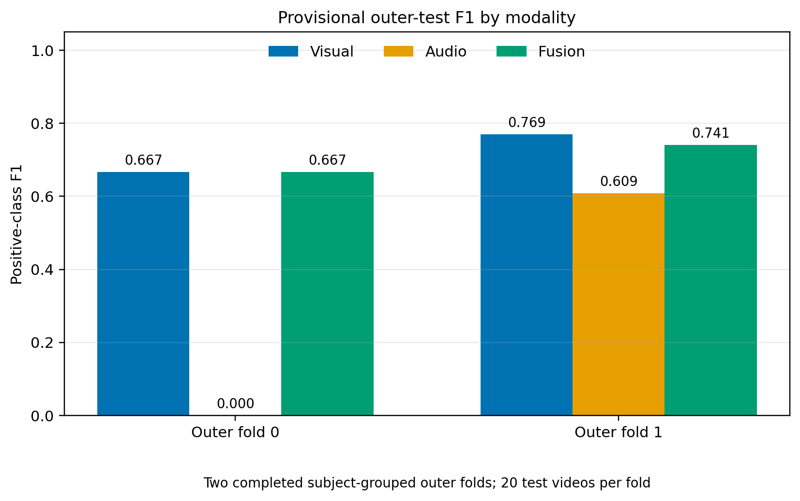

*Figure 1. Positive-class F1 for visual, audio and fused predictions on the identical subject-grouped outer-test videos. Only completed outer folds 0 and 1 are shown. each contains 20 videos.*

### 9.6 Fusion diagnostics

| Quantity | Fold 0 | Fold 1 | Completed-fold aggregate |
| --- | ---: | ---: | ---: |
| Fixed visual weight $ \lambda $ | 0.500 | 0.500 | 0.500 |
| Fixed audio weight $1-\lambda$ | 0.500 | 0.500 | 0.500 |
| Mean absolute visual weighted-logit share | 0.735 | 0.943 | 0.839 ± 0.104 |
| Mean absolute audio weighted-logit share | 0.265 | 0.057 | 0.161 ± 0.104 |
| Clips where fusion corrects visual | 2 | 0 | 2 / 40 |
| Clips where fusion harms visual | 1 | 1 | 2 / 40 |
| Clips where visual and audio predictions disagree | 18 | 9 | 27 / 40 (67.5%) |

Equal fusion weights do not produce equal numerical influence because the branches emit logits on different scales. Here the visual branch supplies 83.9% of the mean absolute weighted-logit magnitude across the completed folds and therefore dominates the fused score, especially in fold 1. This is a descriptive scale diagnostic, not causal evidence of modality importance. The paired corrections and errors above are the relevant test of whether fusion adds predictive value, and they are balanced at two corrections and two newly introduced errors.

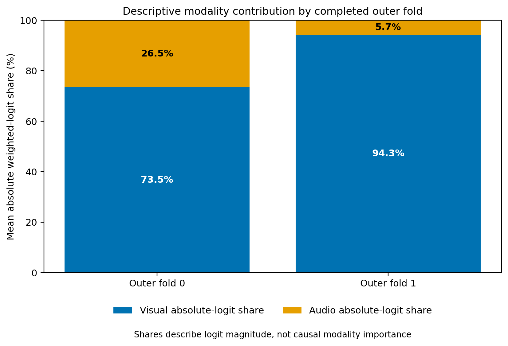

*Figure 2. Mean absolute weighted-logit share by completed outer fold. *
The fixed weights are equal, but the visual logits have much greater magnitude especially in fold 1.
A qualitative error analysis should inspect the 27 disagreement clips for visible but acoustically silent yawns, loud speech mistaken for a yawn, covered mouths, off-axis faces, background speech, low audio level, and yawns that fall between the four sampled one-second audio intervals. These categories cannot be assigned from logits alone and require manually reviewing the source videos.

### 9.7 Training curves and result visualizations

The four final-model TensorBoard runs can be found under `docs/tensorboard/`. They can be reopened from the repository root with:

```powershell
tensorboard --logdir docs/tensorboard --port 6006
```

TensorBoard identifies each immediate subdirectory as a run. The exported plots use the same color assignment throughout: fold-0 audio is pink, fold-0 visual is dark blue-grey, fold-1 audio is purple, and fold-1 visual is orange.

#### 9.7.1 Outer-test confusion matrices

The pooled matrices below are calculated from the 40 independent predictions in the two completed outer folds. Pooling is used here only to visualize the accumulated error types. The fold-wise means and standard deviations in Section 9.4 are the primary cross-validation summary.

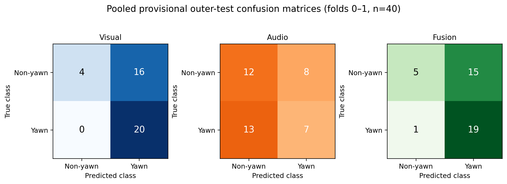

*Figure 3. Pooled outer-test confusion matrices for visual, audio, and fused predictions with($n=40$: 20 yawning and 20 non-yawning videos). *
The visual branch predicts 36 videos as yawning, explaining its perfect recall and low specificity. The audio branch misses 13 of 20 yawns. Fusion predicts 34 videos as yawning and retains most of the visual branch's false positives.
#### 9.7.2 Final-model F1 curves

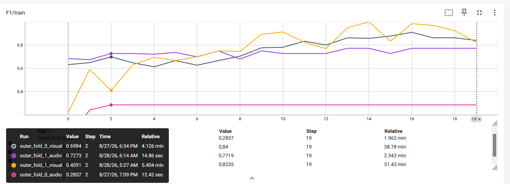

*Figure 4. Training F1 by epoch for the final visual and audio models in completed outer folds 0 and 1. These curves use the final training partition inside each outer fold; they are not outer-test measurements.*

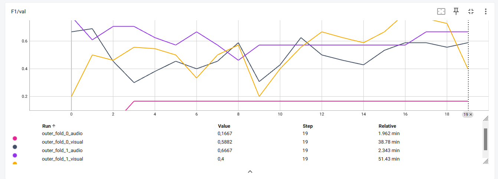

*Figure 5. Final-validation F1 by epoch for the same four models. The selected checkpoints are fold-0 visual epoch 1 (F1 0.690), fold-0 audio epoch 3 (F1 0.167), fold-1 visual epoch 16 (F1 0.800), and fold-1 audio epoch 0 (F1 0.778). Epochs are zero-indexed.*

Training F1 rises most strongly for the fold-1 visual model, while its validation F1 fluctuates and falls from its epoch-16 maximum to 0.400 at epoch 19. The fold-0 audio model reaches only 0.167 validation F1 and then remains flat. These curves support using the best validation checkpoint rather than the final epoch and reinforce the observed instability of the audio branch.

#### 9.7.3 Final-model loss curves

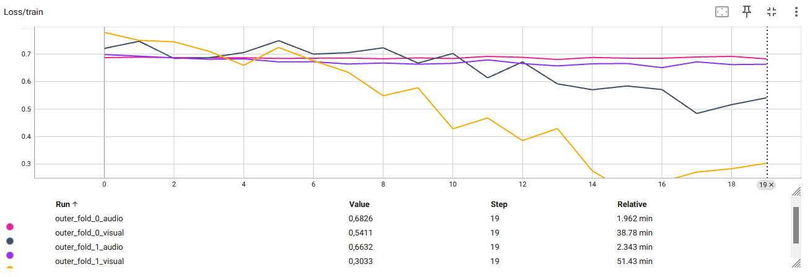

*Figure 6. Sample-weighted training BCE loss by epoch for the four completed final models.*

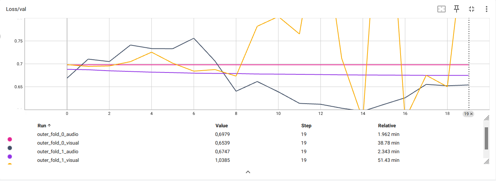

*Figure 7. Sample-weighted final-validation BCE loss by epoch for the same models.*
The fold-1 visual validation loss is highly variable despite its falling training loss, which is consistent with unstable generalization on the small final-validation partition.
The loss curves should be interpreted together with F1. A lower BCE loss does not necessarily select the same epoch as the positive-class F1 objective used by the experiment.


<summary>Supplementary final-validation diagnostics</summary>

The learning-rate schedule confirms the selected constant, step, and exponential policies:

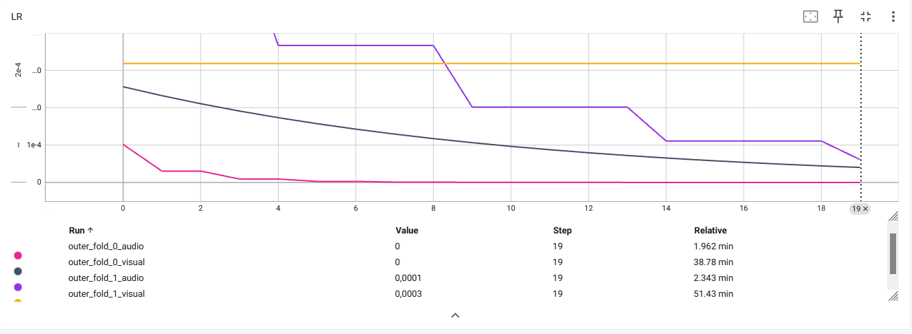

The following precision and recall curves further expose the instability of the small validation partitions:

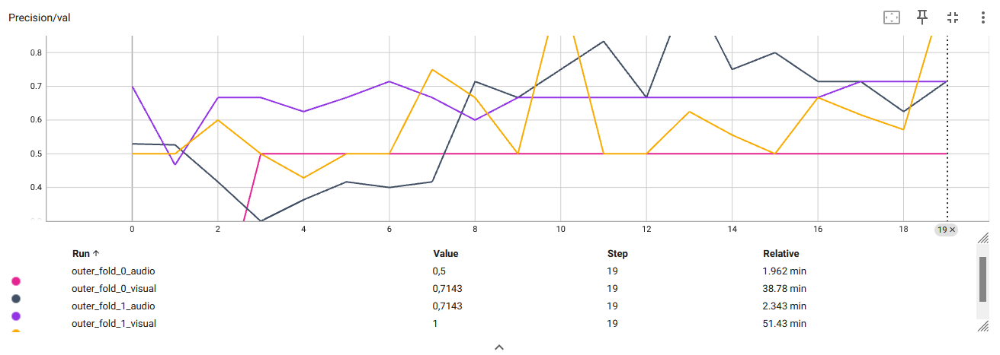

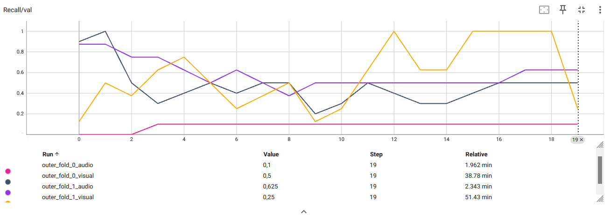

The four matrices below are **final-validation** matrices at the selected checkpoints, as indicated by the TensorBoard tag `Confusion_Matrix/val`. They are not outer-test results. Figure 3 is the appropriate matrix for this.

| Fold 0 visual, epoch 1 | Fold 0 audio, epoch 3 |
| --- | --- |
| 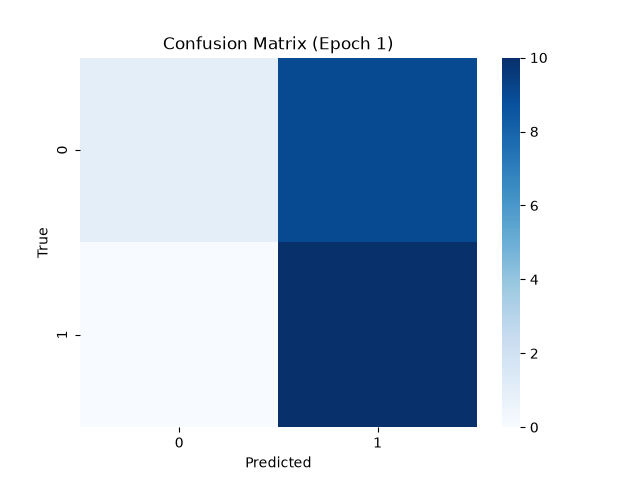 | 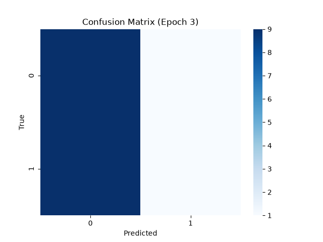 |

| Fold 1 visual, epoch 16 | Fold 1 audio, epoch 0 |
| --- | --- |
| 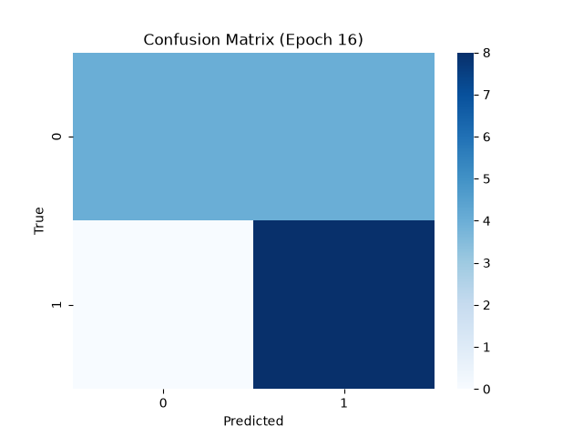 | 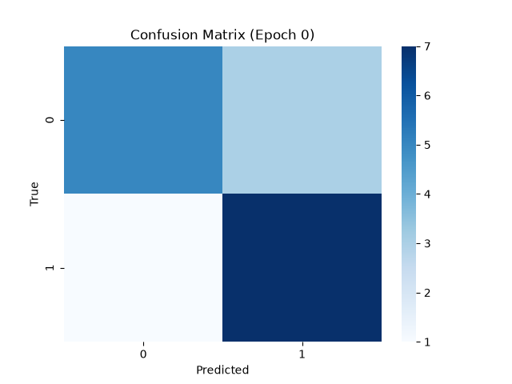 |


### 9.8 Runtime and resource requirements

The complete nested-CV runtime could not be reported as the run has not finished at the time of this commit. Additionaly the logger does not record per-training-run wall-clock durations or peak RAM. These fields are therefore left empty in order not to make assumptions.

| Measurement | Provisional value | Interpretation |
| --- | ---: | --- |
| Completed outer folds | 2 / 5 | Fold 2 was still in visual optimization |
| Visual outer-test processing | Approximately 0.83 s/video over 40 videos | Rough estimate from console progress bars. includes data loading, video decoding, preprocessing, and inference |
| Audio outer-test processing | Approximately 0.054 s/video over 40 videos | Rough estimate from console progress bars. includes audio loading, preprocessing, and inference |
| Fusion arithmetic | Not separately instrumented | Expected to be negligible relative to the two encoders, but it was not measured |
| Total nested-CV time | Not available | The study is incomplete |
| Peak GPU memory | Not applicable | CPU execution |
| Peak RAM and checkpoint size | Not logged | Measure in the final run |

The visual estimate varies significantly between the two folds because their selected batch sizes differ (4 in fold 0 and 8 in fold 1) and console progress timing is not very precise. It is therefore only a rough estimation of the end-to-end test-pipeline throughput.

These measurements are important when moving to an in-vehicle or mobile prototype: prior deployment-oriented drowsiness work shows that model size and latency can become first-class design constraints ([Jabbar et al., 2018](https://doi.org/10.1016/j.procs.2018.04.060)).

### 9.9 Comparison with prior work

Reported values from the literature can only serve as context, not a leaderboard. Label granularity, camera view, preprocessing, participant split, and metric definitions differ across papers. The results are therefore not directly comparable with one another or with this project.

| Work | Core approach | Reported result | Relationship to this project |
| --- | --- | --- | --- |
| [Omidyeganeh et al., 2016](https://doi.org/10.1109/TIM.2015.2507378) | ViolaJones face/mouth detection and temporal mouth-change measurement on embedded hardware | Correct yawning detection rate reported as 65% for mirror and 75% for dash | Lightweight hand-engineered baseline; different metric and protocol |
| [Zhang and Su, 2017](https://doi.org/10.1109/SSCI.2017.8285343) | CNN features followed by LSTM temporal modelling | 88.6% accuracy reported by the paper | Motivates an order-aware temporal baseline |
| [Saurav et al., 2020](https://doi.org/10.1007/978-3-030-44689-5_17) | Mouth-region features from a pretrained CNN, followed by 1D CNN and bidirectional LSTM | Evaluated on manually annotated clips from YawDD and NTHU-DDD | Closely related order-aware yawn classifier; protocol and clip extraction differ |
| [Kielty et al., 2023](https://doi.org/10.1117/12.2680327) | Event-camera representation with CNN, self-attention, and recurrence | 95.9% precision and 94.7% recall on their unseen-subject test; 89.9% and 91.0% on simulated public data | Strong subject-disjoint temporal comparison, but a different sensor representation and dataset |
| [Lu et al., 2023](https://doi.org/10.1109/TITS.2023.3285923) | Key-frame selection, face frontalization, head-pose and facial-action fusion | State-of-the-art YawDD results reported in the paper | Addresses pose and face localization omitted by the present model |
| This work (provisional) | ResNet-18 attention + YAMNet + equal-weight late fusion | Fused accuracy 0.600 ± 0.050 and F1 0.704 ± 0.037 over two of five outer folds | Adds a paired audio ablation and nested subject-grouped evaluation; incomplete result, not a final comparison |

The fairest internal baselines are more important than cross-paper rank:

- mean pooling instead of visual attention;
- visual attention versus an order-aware GRU, LSTM, or temporal convolution;
- visual-only versus audio-only versus fused predictions on identical folds;
- fixed equal fusion versus an inner-selected and optionally calibrated fusion weight.
## 10. Discussion

Just as the results this discussion is preliminary and based on the 40 outer-test video predictions, with 20 videos in each fold. The reported means and standard deviations describe only the completed folds and should not be interpreted as final estimates of generalization performance.

### 10.1 Did multimodal fusion help?

Based on the completed folds, equal-weight late fusion did not improve positive-class F1 compared with the visual model. The visual branch achieved a mean F1 of 0.718 ± 0.051, whereas the fused model achieved 0.704 ± 0.037. This corresponds to a mean paired change of −0.014 ± 0.014. Fusion improved F1 in neither completed fold: in fold 0, visual and fused F1 were equal at 0.667, while in fold 1, F1 decreased from 0.769 to 0.741 after fusion.

The remaining metrics show a similar pattern. Mean accuracy remained unchanged at 0.600, precision changed only slightly from 0.563 to 0.559, and recall decreased from 1.000 to 0.950. At the video level, fusion corrected two errors made by the visual model but also introduced two new errors. The pooled confusion matrices provide further information: fusion reduced the number of visual false positives from 16 to 15, but it also changed one correctly detected yawn into a false negative. Consequently, the additional audio information did not provide a net predictive benefit under the current fusion configuration.

This result does however not establish that audio is generally uninformative for yawning detection. The audio branch was highly unstable, with an F1 of 0.000 in fold 0 and 0.609 in fold 1. Moreover, the visual and audio predictions disagreed on 27 of 40 videos, which shows that the two branches often produced different decisions. These disagreements did not translate into better fused predictions, possibly because of weak audio performance, different logit scales, sparse audio sampling, variation in the audibility of yawns and most importantly label noise. With the current ground truth being derived from the filepath an enormous amount of label noise is introduced for both modalities, but even more so for the audio branch. When sampling 4 Clips of 1 second each from a 30 second clip one covers about 13% of the video. Similarly to the visual branch one might miss or only partially capter a yawn. The most likely scenario is that background noise is labelled as yawning. Due to the sparse nature of the yawns occurring more samples would not have improved this. The solution would be to change the source of ground truth from the filepath to using a list for each video where the frames and timestamps of each yawn are recorded. Additionally the dataset was just simply way too small for meaningful results.

### 10.2 Which modality dominated?

The visual modality dominated the preliminary system, as was expected. Firstly the visual model achieved a substantially higher mean F1 than the audio model, with 0.718 compared with 0.304. Secondly the fused result remained close to the visual result and exceeded the audio result by 0.399 F1 on average. Thirdly the reported two corrections and two newly introduced errors mean that fusion changed the visual decision for only four of the 40 test videos.

The weighted-logit analysis supports this at the numerical level. Both logits received a fixed coefficient of 0.5, but the visual branch contributed an average of 83.9% of the absolute weighted-logit magnitude. Its share was 73.5% in fold 0 and 94.3% in fold 1. The fused scores were therefore influenced much more strongly by the visual logits, especially in fold 1.

However, these magnitude shares should not be interpreted as causal importance of the modality. A branch can produce large logits because its outputs have a different scale or are poorly calibrated, without contributing more useful information. The stronger evidence comes from the paired ablation. The visual branch performed better than the audio branch, and adding audio did not improve F1 over the visual model. The appropriate conclusion is therefore that the visual branch carried most of the predictive performance under the current training and fusion setup, not that visual information is universally more important than audio information.

It should be noted that we can not infer modality importance solely from the configured weight or the mean absolute share. A large-magnitude but poorly calibrated branch can numerically dominate without adding accuracy.

### 10.3 What worked well?
An important strength of the experimental design is that visual, audio, and fused predictions were evaluated on the same outer-test videos. This made the modality comparison paired and allowed individual corrections and newly introduced errors to be identified. Alignment by filepath also reduced the risk of combining predictions from different videos. The modular late-fusion design was useful because each branch could be evaluated independently while still producing a combined result.

At the protocol level, nested subject-grouped cross-validation separates hyperparameter selection and checkpoint selection from outer-test evaluation. The fold-specific hyperparameters in Section 9.3 show that model selection was succesfully repeated independently for each outer fold rather than using one configuration chosen from the test results. Saving the best validation checkpoint was also useful. For example, the fold-1 visual model reached a validation F1 of 0.800 at epoch 16 but fell to 0.400 by epoch 19. Evaluating the final epoch instead of the selected checkpoint would therefore have produced a worse model.

The pretrained encoders made it possible to train both branches without learning their representations entirely from scratch. The visual result suggests that the transferred ResNet-18 features were useful, although the experiment does not include a randomly initialized baseline and therefore cannot specify the benefit of pretraining. In contrast, the frozen YAMNet representation followed by a linear head did not produce stable audio performance across the completed folds.
Either due to the reasons mentioned in the previous section or the classification head design was not appropriate. Most likely both is true.

The stored artifacts also improved traceability. The selected hyperparameters and fold-level results can be reconstructed from the JSON summaries, while the per-video fusion output made the paired error analysis possible. TensorBoard curves and confusion matrices help distinguish training and validation behaviour from independent outer-test performance. These outputs make it easier to identify instability and verify how the reported results were obtained..

### 10.4 What was difficult?
The main difficulty was the limited amount of multimodal data. The audio pipeline could only use 96 of the 736 catalogued videos because the original YawDD recordings do not contain audio. The resulting common subset contained 48 positive and 48 negative videos, and the two completed test folds covered only 40 videos from four logged groups. This small data basis makes both hyperparameter selection and performance estimation extremely dependend on the particular participants assigned to each fold. The large variation of the audio F1, from 0.000 to 0.609, shows this clearly.

The temporal precision of the data is another challenge. Labels apply to complete videos even though a yawn may occupy only a short part of an approximately 30-second recording. The preliminary run sampled 32 visual frames and four one-second audio intervals from each video. A yawn can therefore fall between the sampled intervals, and averaging the audio embeddings can dilute a brief sound. Some yawns may also be silent or weak, while speech and background sounds may produce misleading audio features. The 27 videos on which the branches disagreed should be inspected manually before attributing the errors to any of these causes. Additional reasons are already mentioned at the end of Section 10.1

Nested cross-validation was computationally expensive, particularly because the experiment ran on a CPU. With five trials, three inner folds, two modalities, and one final model per modality, each outer fold can require up to 32 separate model fits before pruning is considered. Visual processing also required decoding a video and applying ResNet-18 to 32 frames per sample in this run. The incomplete state of the experiment—two of five outer folds—and the approximate outer-test processing times of 0.83 seconds per video for the visual branch and 0.054 seconds for the audio branch clearly show the greater cost of the visual pipeline.

Equal-weight fusion of uncalibrated logits presented an additional difficulty, while being conceptually easier at first. A coefficient of 0.5 for each branch did not balance numerical influence, as the visual contribution accounted for 83.9% of the mean absolute fused-logit magnitude regardless. Future experiments should calibrate the logits or select the fusion weight using only inner-validation data. The decision threshold could be handled in the same way.

Both the visual and fused models produced many false alarms. Of the 20 non-yawning test videos, the visual model classified 16 as yawning and the fused model classified 15 as yawning. Their high recall therefore came at the cost of poor rejection of non-yawning behaviour. This is particularly relevant for a practical warning system, where frequent false alarms could reduce user trust.

The offline augmentation, while deemed necessary, assigns the augmented versions new participant IDs. If an original recording and its augmented version occur in different folds, visually similar recordings of the same person can appear in both training and testing. This weakens the intended subject-independent evaluation and may produce optimistic estimates (although it didnt). 

## 11. Limitations and threats to validity

1. **No final empirical results yet.** The architecture and protocol are documented, but effectiveness remains unmeasured until all outer-fold experiments are complete.
2. **Dataset mismatch across modalities.** YawDD supports the visual branch, whereas multimodal evaluation depends on only $48*2=96$ custom recordings. Claims about the value of sound must use the common audio-capable subset.
3. **Weak clip labels and sparse temporal sampling.** A positive filename does not identify yawn onset and offset. Uniform visual sampling and four sparse one-second audio intervals can miss the labelled event.
4. **Attention is not temporal dynamics.** Visual pooling can emphasize frames but is invariant to their order. It cannot distinguish opening from closing motion by sequence direction.
5. **No explicit face or mouth detector.** The centre crop includes the full scene and may devote capacity to background, camera, identity, or illumination cues.
6. **Frozen generic audio representation.** YAMNet was trained for broad AudioSet events, not specifically for yawning. Training only the simple head may underfit.
7. **Raw-logit fusion.** Different calibration and scale between encoders can distort a weighted sum. Fusion weights and calibration must be chosen without outer-test access.
8. **Augmentation is not fold-safe by default.** The offline augmentation script is not called by training and will leak augmented if originals and copies are combined with different group IDs.
9. **Participant-ID collisions.** Grouping male and female participants who share a numeric ID is conservative but reduces the independent group count.
10. **External validity.** YawDD was recorded in parked vehicles, and custom data may be collected under limited conditions. Performance cannot be assumed to generalize to moving vehicles, different cameras, languages, microphones, noise, demographics, or spontaneous rather than acted yawns.

## 12. Repository structure

~~~text
.
├── main.py                         # CLI and experiment entry point
├── requirements.txt               # Pinned Python dependencies
├── src/
│   ├── augment_dataset.py         # Hierarchy-preserving offline video augmentation
│   ├── config.py                  # Optuna search space and fixed settings
│   ├── data.py                    # File parsing, visual dataset, and split helpers
│   ├── data_audio.py              # Four evenly distributed audio clips per video
│   ├── evaluation.py              # Metrics and raw-logit prediction
│   ├── experiment.py              # Nested CV and experiment dispatch
│   ├── fusion.py                  # Weighted late fusion and output files
│   ├── training.py                # Training loop and checkpointing
│   ├── utils.py                   # Seeds, device, optimizer, scheduler, TensorBoard
│   ├── utils_audio.py             # Decoding, clip sampling, padding, and normalization
│   └── models/
│       ├── visual/model.py        # ResNet-18 attention classifier
│       └── audio/yamnet.py        # Frozen YAMNet with clip/video mean pooling
├── test_pipelines.py              # Batch-size-two preprocessing, inference, and fusion tests
└── tests/                         # Three synthetic audio-video fixtures
~~~

## 13. References

1. Abtahi, S., Omidyeganeh, M., Shirmohammadi, S., & Hariri, B. (2014). [YawDD: A yawning detection dataset](https://doi.org/10.1145/2557642.2563678). _Proceedings of the 5th ACM Multimedia Systems Conference_, 24–28.
2. Omidyeganeh, M., Shirmohammadi, S., Abtahi, S., et al. (2016). [Yawning detection using embedded smart cameras](https://doi.org/10.1109/TIM.2015.2507378). _IEEE Transactions on Instrumentation and Measurement, 65_(3), 570–582.
3. He, K., Zhang, X., Ren, S., & Sun, J. (2016). [Deep residual learning for image recognition](https://doi.org/10.1109/CVPR.2016.90). _Proceedings of CVPR_, 770–778.
4. Ilse, M., Tomczak, J. M., & Welling, M. (2018). [Attention-based deep multiple instance learning](https://proceedings.mlr.press/v80/ilse18a.html). _Proceedings of ICML_, 2127–2136.
5. Gemmeke, J. F., Ellis, D. P. W., Freedman, D., et al. (2017). [Audio Set: An ontology and human-labeled dataset for audio events](https://doi.org/10.1109/ICASSP.2017.7952261). _Proceedings of ICASSP_, 776–780.
6. Google Research. [YAMNet: A pretrained audio event classifier](https://github.com/tensorflow/models/tree/master/research/audioset/yamnet). Official model documentation and preprocessing specification.
7. w-hc. [torch_audioset](https://github.com/w-hc/torch_audioset). PyTorch port used by the audio branch.
8. Baltrušaitis, T., Ahuja, C., & Morency, L.-P. (2019). [Multimodal machine learning: A survey and taxonomy](https://doi.org/10.1109/TPAMI.2018.2798607). _IEEE Transactions on Pattern Analysis and Machine Intelligence, 41_(2), 423–443.
9. Varma, S., & Simon, R. (2006). [Bias in error estimation when using cross-validation for model selection](https://doi.org/10.1186/1471-2105-7-91). _BMC Bioinformatics, 7_, 91.
10. Cawley, G. C., & Talbot, N. L. C. (2010). [On over-fitting in model selection and subsequent selection bias in performance evaluation](https://www.jmlr.org/papers/v11/cawley10a.html). _Journal of Machine Learning Research, 11_, 2079–2107.
11. Shorten, C., & Khoshgoftaar, T. M. (2019). [A survey on image data augmentation for deep learning](https://doi.org/10.1186/s40537-019-0197-0). _Journal of Big Data, 6_, 60.
12. Cauli, N., & Reforgiato Recupero, D. (2022). [Survey on videos data augmentation for deep learning models](https://doi.org/10.3390/fi14030093). _Future Internet, 14_(3), 93.
13. Sokolova, M., & Lapalme, G. (2009). [A systematic analysis of performance measures for classification tasks](https://doi.org/10.1016/j.ipm.2009.03.002). _Information Processing & Management, 45_(4), 427–437.
14. Saito, T., & Rehmsmeier, M. (2015). [The precision-recall plot is more informative than the ROC plot when evaluating binary classifiers on imbalanced datasets](https://doi.org/10.1371/journal.pone.0118432). _PLOS ONE, 10_(3), e0118432.
15. Loshchilov, I., & Hutter, F. (2019). [Decoupled weight decay regularization](https://openreview.net/forum?id=Bkg6RiCqY7). _International Conference on Learning Representations_.
16. Srivastava, N., Hinton, G., Krizhevsky, A., Sutskever, I., & Salakhutdinov, R. (2014). [Dropout: A simple way to prevent neural networks from overfitting](https://www.jmlr.org/papers/v15/srivastava14a.html). _Journal of Machine Learning Research, 15_, 1929–1958.
17. Keskar, N. S., Mudigere, D., Nocedal, J., Smelyanskiy, M., & Tang, P. T. P. (2017). [On large-batch training for deep learning: Generalization gap and sharp minima](https://openreview.net/forum?id=H1oyRlYgg). _International Conference on Learning Representations_.
18. Akiba, T., Sano, S., Yanase, T., Ohta, T., & Koyama, M. (2019). [Optuna: A next-generation hyperparameter optimization framework](https://doi.org/10.1145/3292500.3330701). _Proceedings of KDD_, 2623–2631.
19. Guo, C., Pleiss, G., Sun, Y., & Weinberger, K. Q. (2017). [On calibration of modern neural networks](https://proceedings.mlr.press/v70/guo17a.html). _Proceedings of ICML_, 1321–1330.
20. Zhang, W., & Su, J. (2017). [Driver yawning detection based on long short term memory networks](https://doi.org/10.1109/SSCI.2017.8285343). _IEEE Symposium Series on Computational Intelligence_, 1–5.
21. Kielty, P., Dilmaghani, M. S., Ryan, C., Lemley, J., & Corcoran, P. (2023). [Neuromorphic sensing for yawn detection in driver drowsiness](https://doi.org/10.1117/12.2680327). _Proceedings of SPIE 12701, Fifteenth International Conference on Machine Vision_.
22. Lu, Y., Liu, C., Chang, F., Liu, H., & Huan, H. (2023). [JHPFA-Net: Joint head pose and facial action network for driver yawning detection across arbitrary poses in videos](https://doi.org/10.1109/TITS.2023.3285923). _IEEE Transactions on Intelligent Transportation Systems, 24_(11), 11850–11863.
23. Meta PyTorch. [TorchCodec documentation](https://github.com/meta-pytorch/torchcodec). Media-decoding implementation reference.
24. PyTorch. [Torchvision ResNet-18 documentation](https://docs.pytorch.org/vision/stable/models/generated/torchvision.models.resnet18.html). Pretrained weights and canonical preprocessing.
25. Carreira, J., & Zisserman, A. (2017). [Quo vadis, action recognition? A new model and the Kinetics dataset](https://doi.org/10.1109/CVPR.2017.502). _Proceedings of CVPR_, 4724–4733.
26. Saurav, S., Mathur, S., Sang, I., et al. (2020). [Yawn detection for driver's drowsiness prediction using bi-directional LSTM with CNN features](https://doi.org/10.1007/978-3-030-44689-5_17). _Intelligent Human Computer Interaction_, 189–200.
27. Jabbar, R., Al-Khalifa, K., Kharbeche, M., et al. (2018). [Real-time driver drowsiness detection for Android application using deep neural networks techniques](https://doi.org/10.1016/j.procs.2018.04.060). _Procedia Computer Science, 130_, 400–407.
28. Goodfellow, I., Bengio, Y., & Courville, A. (2016). *Deep Learning*. MIT Press. [https://mitpress.mit.edu/9780262035613/deep-learning/](https://mitpress.mit.edu/9780262035613/deep-learning/)
29. Ioffe, S., & Szegedy, C. (2015). Batch normalization: Accelerating deep network training by reducing internal covariate shift. *Proceedings of the 32nd International Conference on Machine Learning*, 448–456. [https://proceedings.mlr.press/v37/ioffe15.html](https://proceedings.mlr.press/v37/ioffe15.html)
30. Kittler, J., Hatef, M., Duin, R. P. W., & Matas, J. (1998). On combining classifiers. *IEEE Transactions on Pattern Analysis and Machine Intelligence, 20*(3), 226–239. [https://doi.org/10.1109/34.667881](https://doi.org/10.1109/34.667881)
31. PyTorch. (n.d.). `BCEWithLogitsLoss`. *Official PyTorch documentation*. [https://docs.pytorch.org/docs/stable/generated/torch.nn.BCEWithLogitsLoss.html](https://docs.pytorch.org/docs/stable/generated/torch.nn.BCEWithLogitsLoss.html)
32. TensorFlow. (n.d.). Sound classification with YAMNet. *Official TensorFlow Hub documentation*. [https://www.tensorflow.org/hub/tutorials/yamnet](https://www.tensorflow.org/hub/tutorials/yamnet)
33. Zaheer, M., Kottur, S., Ravanbakhsh, S., Póczos, B., Salakhutdinov, R., & Smola, A. J. (2017). Deep Sets. *Advances in Neural Information Processing Systems 30*. [https://papers.nips.cc/paper_files/paper/2017/hash/f22e4747da1aa27e363d86d40ff442fe-Abstract.html](https://papers.nips.cc/paper_files/paper/2017/hash/f22e4747da1aa27e363d86d40ff442fe-Abstract.html)
34. Mujtaba, A., Radchenko, G., Masana, M., & Prodan, R. (2025). [YawDD+: Frame-level annotations for accurate yawn prediction](https://doi.org/10.48550/arXiv.2512.11446). *arXiv preprint arXiv:2512.11446*.


