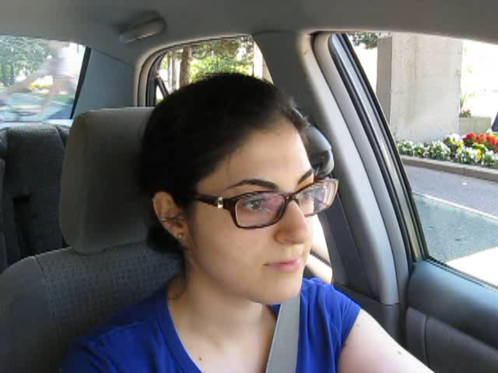
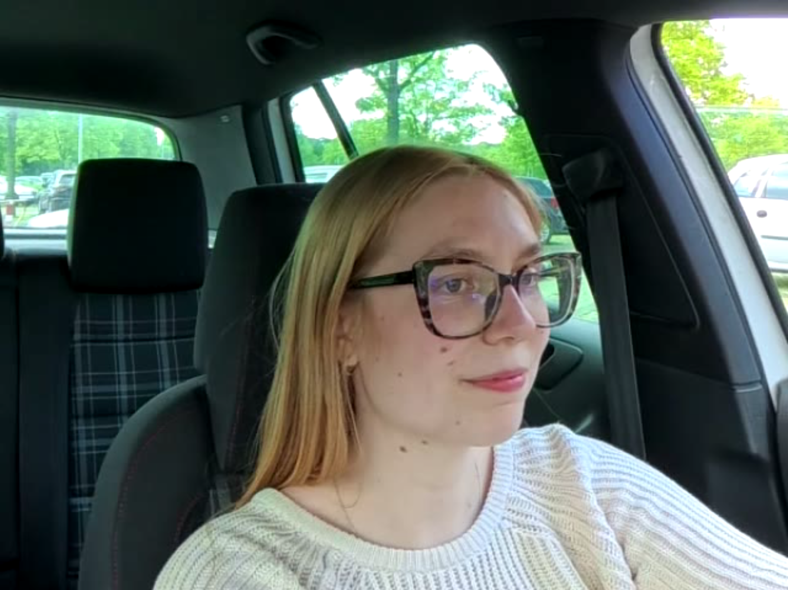
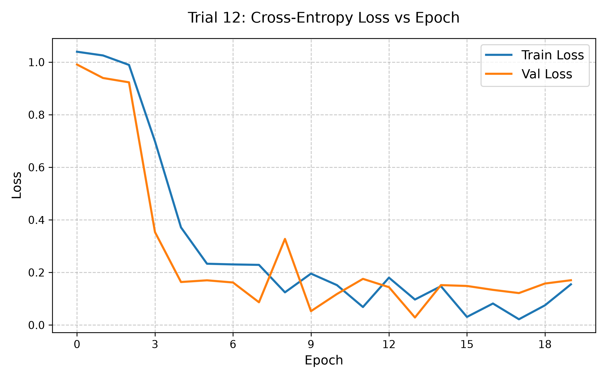
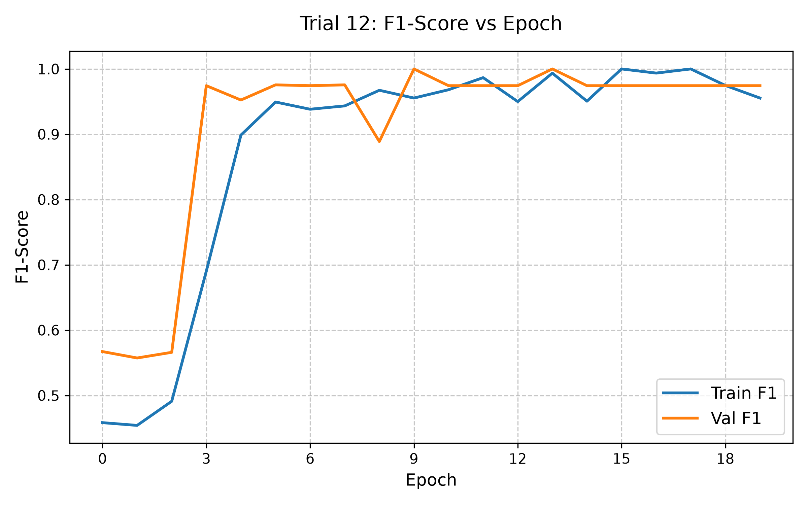

# PWADL 2026: Video-Based Yawning Detection using ResNet Feature Extraction and Temporal Attention

## 1. Problem Description

**Objective & Problem Statement:**
Detecting driver drowsiness is a highly complex, multidimensional challenge critical for enhancing road safety. It is important to acknowledge that true fatigue cannot be reliably determined by a single metric. In this project, the focus lies on visual yawning detection as an indicator for drowsiness. A deep learning pipeline is implemented to classify temporal video sequences into "yawning" or "normal" behavior based on the YawDD dataset [[1]](#ref1). Additionally, a small extension of the YawDD dataset with custom-generated data is included to test domain generalization.

**Model Architecture:**
The proposed model architecture combines spatial feature extraction with temporal aggregation. It consists of the following three main modules:

*   **Spatial Feature Extractor:** A pre-trained ResNet18 [[2]](#ref2) backbone is employed. To process temporal data, the input video is reshaped so that the network evaluates each frame independently as a static image. By removing the final classification head, the network acts purely as a spatial feature extractor, capturing complex facial patterns and outputting a 512-dimensional feature vector per frame.
*   **Temporal Attention Pooling:** Since yawning unfolds over time, a temporal attention mechanism weights the extracted frames. Instead of simple averaging, it computes attention scores to assign higher relevance to peak yawning instances, aggregating them into a single, time-aware feature vector.
*   **Classification Head:** The aggregated vector is processed by a Multi-Layer Perceptron (MLP). The network progressively compresses the features through two hidden layers (512 $\rightarrow$ 256 $\rightarrow$ 128 $\rightarrow$ 1), utilizing Batch Normalization for training stability and Dropout for regularization, ultimately outputting a single binary logit.

**Mathematical Formulation:**
The input to the model is a spatio-temporal video tensor $X \in \mathbb{R}^{B \times T \times C \times H \times W}$, where $B$ is the batch size, $T$ the number of frames, $C$ the color channels, and $H, W$ the spatial dimensions.

**1. Spatial Feature Extraction:**
To process the sequence, the tensor is temporarily reshaped to $((B \cdot T) \times C \times H \times W)$, allowing the network to treat each frame as an independent static image. Spatial feature extraction is performed using a pre-trained ResNet18 backbone. The detailed mathematical foundation of the residual learning framework can be found in the original work by He et al. [[2]](#ref2). For this pipeline, the final classification head of the ResNet is removed, effectively utilizing it as a deep feature extractor that maps each frame to a 512-dimensional continuous vector $f_t$:
$$ f_t \in \mathbb{R}^{512} $$

**2. Temporal Attention Pooling:**
Since yawning unfolds over time, a custom temporal attention mechanism weights the extracted frames $f_t$. A learnable transformation (incorporating weights $W$ and biases $b$ through a Tanh activation) computes an attention score $s_t$. These scores are normalized via softmax to derive the attention weights $\alpha_t$, ensuring that peak yawning instances receive higher relevance. The weighted clip representation $f_{pooled}$ is computed as:
$$ s_t = W_2 \cdot \tanh(W_1 \cdot f_t + b_1) + b_2 $$
$$ \alpha_t = \frac{\exp(s_t)}{\sum_{k=1}^{T} \exp(s_k)} $$
$$ f_{pooled} = \sum_{t=1}^{T} \alpha_t \cdot f_t $$

**3. Classification & Weighted Loss:**
The aggregated vector $f_{pooled}$ is passed through an MLP (512 $\rightarrow$ 256 $\rightarrow$ 128 $\rightarrow$ 1) to output the final logit $z_i$. To counteract the inherent class imbalance within the dataset, a static positive weight factor ($w_{pos} = 2.0$) is explicitly assigned to prioritize the minority class. 
The network is optimized using the weighted Binary Cross-Entropy with Logits loss function, leveraging the native, numerically stable implementation provided by PyTorch [[3]](#ref3). It compares the predicted probabilities $\sigma(z_i)$ (where $\sigma$ denotes the sigmoid function) against the ground truth labels $y_i \in \{0, 1\}$:
$$ L = - \frac{1}{N} \sum_{i=1}^{N} \left[ w_{pos} \cdot y_i \log(\sigma(z_i)) + (1 - y_i) \log(1 - \sigma(z_i)) \right] $$

---

## 2. Dataset

**YawDD Baseline & Filtering:**
The primary data source for this project is the YawDD dataset. To maintain a focused and well-defined classification boundary, a specific subset was utilized: only videos recorded from the internal rearview "Mirror" camera position were included. Furthermore, sequences depicting "talking" were explicitly excluded, restricting the dataset strictly to "yawning" and "normal" driving behaviors.

**Custom Out-of-Distribution (OOD) Extension:**
To evaluate the model's generalization capabilities, the baseline was supplemented with a custom-recorded dataset featuring three additional subjects (two male, one female; recorded with and without glasses). These recordings were carefully staged to replicate the technical specifications of the YawDD dataset, including a similar camera perspective, framerate and resolution. Crucially, the custom recordings were conducted in a different vehicle type featuring a dark interior, which is underrepresented in the original YawDD dataset. These custom sequences were strictly isolated from the training process and used exclusively for the OOD test set.

**Demographic Distribution & Visual Comparison:**
A key distinction between the foundational dataset and the custom extension lies in their demographic and geographic origins. The YawDD dataset features a diverse subject pool primarily originating from the Caucasus, Middle East, Asia, and Africa. In contrast, the custom OOD dataset consists exclusively of Central European subjects. While YawDD inherently provides high variance in lighting and vehicle backgrounds, this demographic discrepancy introduces a distinct domain shift (e.g., varying facial topologies, features, and skin tones). 

<p align="center">
  
  
  <br>
  <em>Figure 1: Visual comparison illustrating the domain shift between datasets. Left: Subject from the YawDD Dataset. Right: Subject from the Custom Central European Dataset.</em>
</p>

**Data Split (Train, Val, Test):**
To rigorously prevent data leakage during training, a subject-grouped split was implemented utilizing the `GroupShuffleSplit` algorithm from the scikit-learn library [[4]](#ref4). This guarantees that video sequences from the same subject (identified by a unique ID combined with gender) never overlap across the training, validation, and in-distribution test subsets.

**Setup & Preprocessing:**
Videos are processed by extracting a defined number of evenly distributed frames over time using OpenCV [[5]](#ref5). The extracted frames are subsequently transformed into tensors, resized to 256x341 pixels, center-cropped to 224x224, and normalized using standard ImageNet statistics.

---

## 3. Code & Execution

**Baseline Architecture & Acknowledgement:**
The fundamental codebase structure of this pipeline is built upon a baseline provided by Prof. Dr. Anne Stockem Novo for the PWADL 2026 module [[6]](#ref6). For this project, the provided pipeline was extended and optimized, including advanced data leakage prevention, integration of Optuna [[7]](#ref7) for hyperparameter tuning, custom data splitting, loading using OpenCV and early stopping mechanisms.

**Dependencies (Setup):**
This project requires a Python installation, including multiple libraries which can be installed via:
```bash
pip install -r requirements.txt
```

**Command-Line Arguments (CLI):**
The pipeline is strictly controlled via `main.py` using `argparse`. The following arguments are available:
*   `--mode` (str): Defines the execution mode. Choose either `train` (for hyperparameter tuning and model training) or `test` (for evaluation on the Out-of-Distribution dataset). Default is `train`.
*   `--prepare_data` (flag): If passed, the script runs the data preparation step and splits raw video files before initiating the training process.
*   `--num_frames` (int): Determines the number of frames to extract per video sequence for the temporal attention pooling. Default is `64`.
*   `--epochs` (int): Sets the maximum number of training epochs per Optuna trial.
*   `--n_trials` (int): Specifies the total number of Optuna exploration trials for hyperparameter optimization.
*   `--patience` (int): Number of epochs to wait for validation loss improvement before triggering early stopping. Default is `7`.
*   `--data_fraction` (float): Fraction of the dataset to use (ranging from 0.0 to 1.0). Highly useful for debugging and dry-runs without loading the full dataset. Default is `1.0`.
*   `--model_path` (str): The path to the saved `.pth` checkpoint file. Primarily used when running in `test` mode. Default is `models/best_yawdd_model.pth`.

**Usage Examples:**
The pipeline can be executed in two distinct modes. The following examples demonstrate how to utilize the arguments effectively:

```bash
# 1. Initial setup, data preparation, and full hyperparameter optimization
python main.py --mode train --prepare_data --data_fraction 1 --n_trials 15 --epochs 20 --patience 7

# 2. Evaluate the best saved model on the test set (Inference Mode)
python main.py --mode test --model_path models/best_yawdd_model.pth
```

**Training & Hyperparameters:**
The hyperparameter optimization is handled by Optuna, executing an exploration space of 15 trials with a maximum limit of 20 epochs per trial.
*   **Optimizer:** AdamW (Adaptive Moment Estimation with Weight Decay set to 1e-2) [[8]](#ref8) was utilized to enhance regularization and prevent overfitting.
*   **Tuned parameters:** Batch Size, Learning Rate, Dropout, Freeze Backbone.
*   **Early Stopping:** The training loop utilizes an Early Stopping mechanism (patience = 7) based on the validation loss.

**Source Code Documentation:**
For a more granular understanding of the specific functions, class structures, and pipeline mechanics, please refer directly to the provided Python scripts. All core modules and operational steps are documented using inline comments and standard PEP 257 docstrings.

---

## 4. Results & Discussion

**Computational Resources & Runtime:**
Model training and hyperparameter optimization were conducted locally. The workstation is equipped with an NVIDIA RTX 4070 Ti (12GB VRAM), an AMD Ryzen 7 7800X3D CPU, and 32GB DDR5-RAM (CL-28). Due to the memory-intensive nature of processing spatio-temporal video tensors with a ResNet18 backbone, the batch size was constrained during the Optuna search space definition to prevent VRAM overflow. The full hyperparameter search (20 epochs, 15 trials) took approximately 3 hours and 51 minutes to complete.

**Evaluation Metrics, Logging & Overfitting Prevention:**
To evaluate model performance, standard classification metrics were computed utilizing scikit-learn, based on the counts of True Positives ($TP$), True Negatives ($TN$), False Positives ($FP$), and False Negatives ($FN$):

*   **Accuracy:** $$ \text{Accuracy} = \frac{TP + TN}{TP + TN + FP + FN} $$
*   **Precision:** $$ \text{Precision} = \frac{TP}{TP + FP} $$
*   **Recall:** $$ \text{Recall} = \frac{TP}{TP + FN} $$
*   **F1-Score:** $$ \text{F1-Score} = 2 \cdot \frac{\text{Precision} \cdot \text{Recall}}{\text{Precision} + \text{Recall}} $$

All training dynamics, metrics, and hyperparameter trials were logged and visualized using TensorBoard [[9]](#ref9). The primary objective metric for the Optuna hyperparameter optimization was the validation F1-Score. Crucially, the Binary Cross-Entropy (BCE) Loss was closely monitored across both training and validation splits. The validation loss served as the primary indicator for overfitting and was directly coupled with an Early Stopping mechanism (patience = 7). A continuously increasing validation loss value over multiple epochs directly indicates a degradation in the generalization capabilities of the model.

**Training Dynamics & Best Trial (Trial 12):**
The hyperparameter search concluded successfully after 15 trials, with Trial 12 yielding the most robust validation performance. The optimal hyperparameters for this trial were determined as follows:
*   **Batch Size:** 8
*   **Learning Rate:** $2.04 \times 10^{-4}$ (0.0002035)
*   **Dropout:** 0.3
*   **Backbone:** Unfrozen (`freeze_backbone = False`), allowing for end-to-end fine-tuning of the spatial ResNet18 feature extractor.

The model achieved its peak validation F1-Score early in the training process, successfully locking in the best checkpoint at **Epoch 9**. The model weights from this specific epoch were extracted and utilized for all subsequent evaluations.

<p align="center">
  
  
  <br>
  <em>Figure 2: Training dynamics of the best-performing model (Trial 12). Left: Loss progression vs epochs. Right: F1-Score vs epochs (Best model saved at Epoch 9).</em>
</p>

**Results & Out-of-Distribution (OOD) Testing:**
To test the model's generalization capabilities, the evaluation is divided into three distinct subsets:
*   **YawDD (In-Distribution):** The isolated 15% test split from the original YawDD dataset, representing known demographic and environmental distributions.
*   **Custom (OOD):** The recorded Central European dataset featuring novel subjects and a dark vehicle interior.
*   **Mixed (YawDD + Custom):** The combined dataset, serving as the benchmark for the model's overall robustness.

Initially, predictions were evaluated using a standard **0.5 confidence threshold**:

| Test Scenario (Threshold 0.5) | Accuracy | F1-Score | Precision | Recall |
| :--- | :--- | :--- | :--- | :--- |
| **YawDD (In-Distribution)** | 95.92% | 94.12% | 94.12% | 94.12% |
| **Custom (OOD)** | 66.67% | 50.00% | 100.00% | 33.33% |
| **Mixed (YawDD + Custom)** | 90.16% | 85.71% | 94.74% | 78.26% |

**Decision Threshold Optimization:**
The initial OOD evaluation revealed a significant degradation in model performance. While the model maintained a perfect OOD Precision (100.00%)—indicating zero false positives—the Recall dropped sharply to 33.33%. This indicated poor domain generalization, with the model failing to recognize yawning under varying environmental conditions.
To mitigate this without retraining, the decision threshold was calibrated. Lowering the threshold to 0.35 yielded a significant performance improvement:

| Test Scenario (Threshold 0.35) | Accuracy | F1-Score | Precision | Recall |
| :--- | :--- | :--- | :--- | :--- |
| **YawDD (In-Distribution)** | 95.92% | 94.12% | 94.12% | 94.12% |
| **Custom (OOD)** | 75.00% | 66.67% | 100.00% | 50.00% |
| **Mixed (YawDD + Custom)** | 91.80% | 88.37% | 95.00% | 82.61% |

**Discussion & Domain Shift:**
The threshold calibration successfully increased the OOD Recall by over 16 percentage points (from 33.33% to 50.00%) while preserving the 100.00% Precision. The In-Distribution performance remained completely unaffected, indicating that the model's baseline confidence on known data appears to be robust, yielding a strong In-Distribution F1-Score of 94.12%. 

However, while such high intra-dataset metrics demonstrate strong baseline performance, the OOD testing highlights the model's sensitivity to unseen environments. While the exact underlying cause for the observed domain shift cannot be definitively isolated without further testing, it strongly suggests that for broader real-world applications, the network's generalization is constrained by an inherent dataset bias stemming from the limited demographic and environmental variance of the training data. The YawDD dataset features a distinct distribution of lighting, vehicle backgrounds, and subject demographics. In contrast, the custom test set introduces novel conditions, including a dark vehicle interior and previously unseen subjects, which likely caused the initial drop in recall. Consequently, adjusting the prediction threshold proved to be an effective method for enhancing model performance, though it cannot replace a fundamental dataset expansion.

**Comparison with Prior Coursework (PWADL 2025):**
To benchmark the In-Distribution results, the performance metrics were compared with the preceding module project from the 2025 summer semester course [[10]](#ref10). The prior work utilized a highly comparable architecture, employing a ResNet18 backbone paired with an attention-pooling mechanism on the YawDD dataset. The 2025 baseline achieved an In-Distribution Accuracy of 93.75% and a weighted F1-Score of 93.70%. 

The optimized model, presented in this project, slightly outperforms this baseline on the known data distribution, achieving an Accuracy of 95.92% and an F1-Score of 94.12%. More importantly, the prior coursework explicitly noted that its generalization to other domains remained untested and that its hyperparameters were not systematically optimized [[10]](#ref10). By introducing the robust Optuna hyperparameter search and rigorously evaluating the model on a custom Out-of-Distribution dataset, this project directly addresses these previous limitations, further expanding the findings towards an evaluation of real-world robustness.

**Limitations & Future Work:**
While the current architecture and optimized threshold provide a strong baseline, there are several tasks for future research:
*   **Safety Trade-offs & Threshold Calibration:** While the 0.35 threshold improved recall, a rigorous deployment in Advanced Driver Assistance Systems (ADAS) requires prioritizing functional safety. Missing a yawning event (false negative) carries a significantly higher risk than a false alarm. Future iterations should systematically evaluate a wider range of confidence thresholds on much larger OOD datasets to pinpoint the exact decision boundary that maximizes passenger safety without causing alarm fatigue.
*   **Holistic Fatigue Detection & Multimodal Sensor Fusion:** The current scope is strictly limited to yawning and facial expressions, which covers only a fraction of actual drowsiness symptoms. A reliable Advanced Driver Assistance System (ADAS) should expand beyond this limitation through true multimodal sensor fusion, integrating a multitude of physiological, behavioral, and vehicle telemetry markers. This includes visual tracking of eye closure (e.g., PERCLOS metric [[11]](#ref11)), audio indicators (e.g., yawning noise recognition), gaze and attention estimation, as well as vehicle telemetry such as steering behavior and lane deviations.
*   **Advanced IR & Physiological Monitoring:** Relying exclusively on optical RGB data renders the current model ineffective for nighttime driving. Transitioning to thermal and near-infrared (IR) imaging not only solves the low-light constraint but enables advanced non-contact physiological monitoring. For instance, high-resolution IR sensors can be utilized to track pulse variations and measure respiration rates (e.g., by detecting the absorption of thermal radiation by CO2 in exhaled breath). 
*   **Data Expansion & Architectural Scaling:** To fundamentally overcome the observed generalization issues, future iterations should significantly expand and diversify the recordings. Additionally, evaluating higher-capacity architectures like Vision Transformers (ViTs) [12] represents a promising avenue for future research.
---

## 5. Declaration of AI Usage

In the development of this project, Generative AI tools were utilized as assistive technologies for coding and documentation. Specifically:
*   **GitHub Copilot** was used within Visual Studio Code for real-time code completion, syntax suggestions, and boilerplate generation.
*   **Google Gemini** was employed as a conversational assistant for debugging, discussing architectural optimizations, and structuring documentation.

All AI-generated suggestions and code snippets were critically reviewed, rigorously tested, and modified to fit the specific requirements of the module. The final implementation, architectural decisions, and scientific conclusions remain the sole responsibility of the author.

---

## 6. References

<a id="ref1"></a>
**[1] YawDD Dataset:**
```bibtex
@inproceedings{Abtahi2014YawDD,
  title={YawDD: A yawning detection dataset},
  author={Abtahi, Shabnam and Omidyeganeh, Mona and Shirmohammadi, Shervin and Hariri, Behnoosh},
  booktitle={Proceedings of the 5th ACM Multimedia Systems Conference},
  pages={24--28},
  year={2014}
}
```
<br>

<a id="ref2"></a>
**[2] ResNet Architecture:**
```bibtex
@inproceedings{he2016deep,
  title={Deep residual learning for image recognition},
  author={He, Kaiming and Zhang, Xiangyu and Ren, Shaoqing and Sun, Jian},
  booktitle={Proceedings of the IEEE conference on computer vision and pattern recognition},
  pages={770--778},
  year={2016}
}
```
<br>

<a id="ref3"></a>
**[3] PyTorch Framework:**
```bibtex
@incollection{paszke2019pytorch,
  title={PyTorch: An Imperative Style, High-Performance Deep Learning Library},
  author={Paszke, Adam and Gross, Sam and Massa, Francisco and Lerer, Adam and Bradbury, James and Chanan, Gregory and Killeen, Trevor and Lin, Zeming and Gimelshein, Natalia and Antiga, Luca and Desmaison, Alban and Kopf, Andreas and Yang, Edward and DeVito, Zachary and Raison, Martin and Tejani, Alykhan and Chilamkurthy, Sasank and Steiner, Benoit and Fang, Lu and Bai, Junjie and Chintala, Soumith},
  booktitle={Advances in Neural Information Processing Systems 32},
  pages={8024--8035},
  year={2019},
  publisher={Curran Associates, Inc.}
}
```
<br>

<a id="ref4"></a>
**[4] Scikit-Learn:**
```bibtex
@article{scikit-learn,
  title={Scikit-learn: Machine Learning in {P}ython},
  author={Pedregosa, F. and Varoquaux, G. and Gramfort, A. and Michel, V.
          and Thirion, B. and Grisel, O. and Blondel, M. and Prettenhofer, P.
          and Weiss, R. and Dubourg, V. and Vanderplas, J. and Passos, A. and
          Cournapeau, D. and Brucher, M. and Perrot, M. and Duchesnay, E.},
  journal={Journal of Machine Learning Research},
  volume={12},
  pages={2825--2830},
  year={2011}
}
```
<br>

<a id="ref5"></a>
**[5] OpenCV Library:**
```bibtex
@article{bradski2000opencv,
  title={The OpenCV Library},
  author={Bradski, Gary},
  journal={Dr. Dobb's Journal of Software Tools},
  year={2000}
}
```
<br>

<a id="ref6"></a>
**[6] Code Baseline & Course Information:**
```bibtex
@misc{Stockemnovo2026PWADL,
  author={Stockem Novo, Anne},
  title={Baseline Codebase for PWADL 2026},
  howpublished={Course Material: Praktisches wissenschaftliches Arbeiten mit Deep Learning (Master of Engineering, Maschinenbau), Westf{\"a}lische Hochschule},
  year={2026},
  note={Campus Gelsenkirchen, Bocholt, Recklinghausen}
}
```
<br>

<a id="ref7"></a>
**[7] Optuna:**
```bibtex
@inproceedings{akiba2019optuna,
  title={Optuna: A next-generation hyperparameter optimization framework},
  author={Akiba, Takuya and Sano, Shotaro and Yanase, Toshihiko and Ohta, Takeru and Koyama, Masanori},
  booktitle={Proceedings of the 25th ACM SIGKDD international conference on knowledge discovery \& data mining},
  pages={2623--2631},
  year={2019}
}
```
<br>

<a id="ref8"></a>
**[8] AdamW Optimizer:**
```bibtex
@inproceedings{loshchilov2017decoupled,
  title={Decoupled Weight Decay Regularization},
  author={Loshchilov, Ilya and Hutter, Frank},
  booktitle={International Conference on Learning Representations (ICLR)},
  year={2019}
}
```
<br>

<a id="ref9"></a>
**[9] TensorBoard:**
```bibtex
@misc{abadi2015tensorflow,
  title={TensorFlow: Large-Scale Machine Learning on Heterogeneous Systems},
  author={Mart\'{i}n Abadi and Ashish Agarwal and Paul Barham and Eugene Brevdo and Zhifeng Chen and Craig Citro and Greg S. Corrado and Andy Davis and Jeffrey Dean and Matthieu Devin and Sanjay Ghemawat and Ian Goodfellow and Andrew Harp and Geoffrey Irving and Michael Isard and Yangqing Jia and Rafal Jozefowicz and Lukasz Kaiser and Manjunath Kudlur and Josh Levenberg and Dandelion Man\'{e} and Rajat Monga and Sherry Moore and Derek Murray and Chris Olah and Mike Schuster and Jonathon Shlens and Benoit Steiner and Ilya Sutskever and Kunal Talwar and Paul Tucker and Vincent Vanhoucke and Vijay Vasudevan and Fernanda Vi\'{e}gas and Oriol Vinyals and Pete Warden and Martin Wattenberg and Martin Wicke and Yuan Yu and Xiaoqiang Zheng},
  year={2015},
  note={Software available from tensorflow.org (Includes TensorBoard)}
}
```
<br>

<a id="ref10"></a>
**[10] Module Project SS2025 (Baseline):**
```bibtex
@misc{Lucas2025PWADL,
  author={Lucas},
  title={Video-basierte Gähnen-Erkennung mit Attention-Pooling},
  howpublished={Course Project: Praktisches wissenschaftliches Arbeiten mit Deep Learning (Master), Westf{\"a}lische Hochschule},
  year={2025},
  note={SS2025}
}
```
<br>

<a id="ref11"></a>
**[11] PERCLOS Metric:**
```bibtex
@techreport{dinges1998perclos,
  title={PERCLOS: A valid psychophysiological measure of alertness as assessed by psychomotor vigilance},
  author={Dinges, David F and Grace, Richard},
  year={1998},
  institution={United States. Federal Highway Administration}
}
```
<br>

<a id="ref12"></a>
**[12] Vision Transformers (ViT):**
```bibtex
@inproceedings{dosovitskiy2020image,
  title={An Image is Worth 16x16 Words: Transformers for Image Recognition at Scale},
  author={Dosovitskiy, Alexey and Beyer, Lucas and Kolesnikov, Alexander and Weissenborn, Dirk and Zhai, Xiaohua and Unterthiner, Thomas and Dehghani, Mostafa and Minderer, Matthias and Heigold, Georg and Gelly, Sylvain and Uszkoreit, Jakob and Houlsby, Neil},
  booktitle={International Conference on Learning Representations (ICLR)},
  year={2021}
}
```